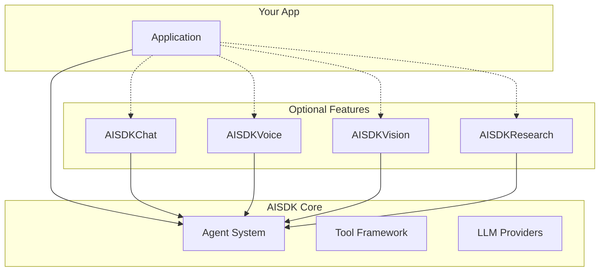

# AISDK Documentation

Welcome to the AISDK documentation! This comprehensive guide will help you integrate and use AISDK in your Swift applications.

## Overview

AISDK is a powerful, modular Swift package for building AI-powered applications with support for:
- 🤖 Multiple LLM providers (OpenAI, Claude)
- 🛠️ Advanced tool system with UI rendering capabilities
- 💬 Complete chat management system
- 🎙️ Native voice interactions (AVFoundation/Speech framework)
- 👁️ LiveKit-powered vision features
- 🔬 Specialized research capabilities
- 📱 Full multiplatform support (iOS 18+, macOS, watchOS, tvOS)

## Documentation Structure

### 📚 Core Documentation

- **[AISDK.md](AISDK.md)** - Complete overview and architecture guide
- **[APIReference.md](APIReference.md)** - Detailed API documentation for all public interfaces
- **[GettingStarted.md](GettingStarted.md)** - Step-by-step tutorial to get you started
- **[PackageStructure.md](PackageStructure.md)** - Detailed package organization and build configuration
- **[Package.swift.example](Package.swift.example)** - Example Swift package configuration


### 🔧 Feature Guides

#### Tools System
- Creating basic tools
- Implementing RenderableTool for UI
- Tool parameter validation
- Best practices for tool design

#### Chat Features
- Session management
- Storage protocol implementation
- Custom UI components
- Attachment handling

#### Voice Mode
- Native speech recognition setup
- Speech synthesis configuration
- Voice UI components
- Audio session management

#### Vision Mode
- LiveKit integration
- Camera setup
- Real-time streaming
- Agent interaction

#### Research Mode
- Research agent configuration
- Evidence management
- Custom research tools
- Result presentation

### 💾 Storage Adapters

- **Storage Protocol** - Core protocol definition
- **Firebase Adapter** - Implementation guide for Firebase/Firestore
- **Supabase Adapter** - Implementation guide for Supabase
- **Custom Storage** - Creating your own storage backend

## Quick Links

### Getting Started
1. [Installation](GettingStarted.md#installation)
2. [Basic Setup](GettingStarted.md#quick-start)
3. [First Chat App](GettingStarted.md#step-by-step-tutorial)
4. [Adding Tools](GettingStarted.md#using-tools-with-ui-rendering)
5. [Voice Integration](GettingStarted.md#voice-enabled-chat)

### Common Tasks
- [Create a custom tool](APIReference.md#tool)
- [Implement UI rendering](APIReference.md#renderabletool)
- [Handle streaming responses](APIReference.md#sendstream)
- [Manage chat sessions](APIReference.md#aichatmanager)
- [Add voice capabilities](APIReference.md#aivoicemode)

### Advanced Topics
- [Custom LLM providers](APIReference.md#llm-protocol)
- [Storage implementation](APIReference.md#storage-protocol)
- [Error handling](APIReference.md#error-types)
- [Testing strategies](PackageStructure.md#testing-structure)

## Package Products

AISDK is organized into modular products that you can adopt as needed:

| Product | Description | Required |
|---------|-------------|----------|
| `AISDK` | Core AI functionality, agents, tools, LLM providers | ✅ Yes |
| `AISDKChat` | Chat UI components, session management, storage | ⬜ No |
| `AISDKVoice` | Native voice recognition and synthesis | ⬜ No |
| `AISDKVision` | LiveKit-based real-time video features | ⬜ No |
| `AISDKResearch` | Specialized research agents and tools | ⬜ No |

## Code Examples

### Basic Agent
```swift
import AISDK

let agent = try Agent(model: .gpt4o)
let response = try await agent.send("Hello!")
print(response.content)
```

### Chat with UI
```swift
import AISDK
import AISDKChat

let chatManager = AIChatManager(
    agent: try! Agent(model: .gpt4o),
    storage: MemoryStorage()
)

// Use in SwiftUI
ChatCompanionView(manager: chatManager)
```

### Tool with UI Rendering
```swift
struct WeatherTool: RenderableTool {
    let name = "get_weather"
    let description = "Get weather with visual display"
    
    @Parameter(description: "City name")
    var city: String = ""
    
    func execute() async throws -> (content: String, metadata: ToolMetadata?) {
        let weather = try await fetchWeather(for: city)
        let jsonData = try JSONEncoder().encode(weather)
        let metadata = RenderMetadata(toolName: name, jsonData: jsonData)
        
        return ("Weather: \(weather.temp)°F", metadata)
    }
    
    func render(from data: Data) -> AnyView {
        let weather = try? JSONDecoder().decode(Weather.self, from: data)
        return AnyView(WeatherWidget(weather: weather))
    }
}
```

### Voice Interaction
```swift
import AISDKVoice

@State private var voiceMode = AIVoiceMode()

// Start voice conversation
try await voiceMode.startConversation(with: agent)

// Or use the provided view
AIVoiceModeView(agent: agent)
```

## Requirements

- **Xcode**: 15.0+
- **Swift**: 5.9+
- **Platforms**:
  - iOS 18.0+
  - macOS 14.0+
  - watchOS 11.0+
  - tvOS 18.0+

## Installation

### Swift Package Manager

```swift
dependencies: [
    .package(url: "https://github.com/yourusername/AISDK.git", from: "1.0.0")
]
```

### Xcode

1. File → Add Package Dependencies
2. Enter: `https://github.com/yourusername/AISDK.git`
3. Select the products you need

## Architecture Overview



## Key Features

### 🤖 Intelligent Agents
- Support for GPT-4, Claude, and more
- Streaming responses
- Tool execution
- Conversation management
- State callbacks

### 🛠️ Advanced Tools
- Define custom tools with parameters
- Automatic JSON schema generation
- UI rendering with RenderableTool
- Validation and error handling
- Async execution

### 💬 Rich Chat Experience
- Complete chat UI components
- Session management
- Storage abstraction
- Attachment support
- Suggested questions
- Markdown rendering

### 🎙️ Native Voice
- Built on AVFoundation
- Speech recognition
- Text-to-speech
- Voice activity detection
- Custom UI components

### 👁️ Vision Capabilities
- LiveKit integration
- Real-time video
- Camera management
- Agent interaction

### 🔬 Research Features
- Specialized research agents
- Evidence gathering
- Source management
- Report generation

## Community & Support

- **GitHub**: [github.com/yourusername/AISDK](https://github.com/yourusername/AISDK)
- **Discord**: [Join our community](https://discord.gg/aisdk)
- **Email**: support@aisdk.dev
- **Documentation**: [docs.aisdk.dev](https://docs.aisdk.dev)

## Contributing

We welcome contributions! Please see our [Contributing Guide](https://github.com/yourusername/AISDK/blob/main/CONTRIBUTING.md) for details.

## License

AISDK is available under the MIT license. See the [LICENSE](https://github.com/yourusername/AISDK/blob/main/LICENSE) file for more info.

---

© 2025 AISDK. Built with ❤️ using Swift. 