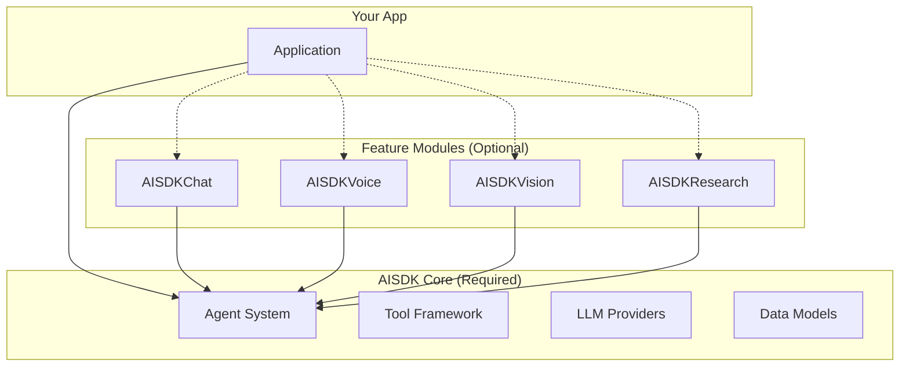
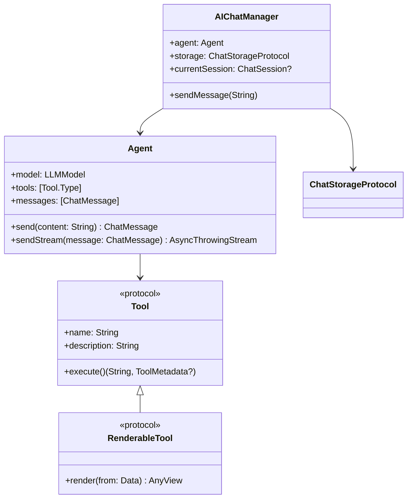
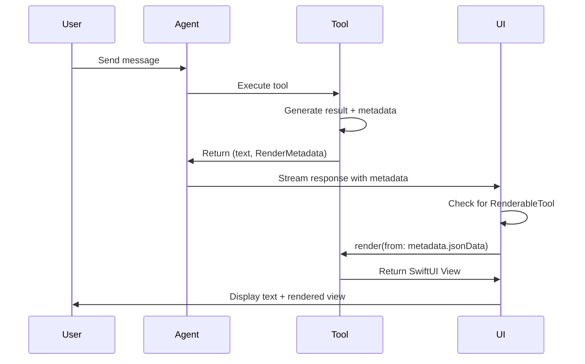

# AISDK - AI Software Development Kit for Swift

A comprehensive, multiplatform Swift package for building AI-powered applications with support for multiple LLM providers, streaming responses, tool execution, UI-rendering capabilities, and advanced conversational features.

## Table of Contents

1. [Overview](#overview)
2. [Architecture](#architecture)
3. [Installation](#installation)
4. [Core Components](#core-components)
5. [Feature Modules](#feature-modules)
6. [Tools & UI Rendering](#tools--ui-rendering)
7. [Usage Examples](#usage-examples)
8. [Storage](#storage)
9. [Best Practices](#best-practices)
10. [Troubleshooting](#troubleshooting)

## Overview

AISDK is a powerful Swift package that provides a unified interface for integrating Large Language Models (LLMs) into your applications. Built with modularity in mind, it offers separate targets for different features while maintaining a cohesive API design.

### Key Features

- 🤖 **Multiple LLM Providers**: OpenAI and Claude support with extensible architecture
- 🔄 **Streaming Support**: Real-time streaming responses with Server-Sent Events (SSE)
- 🛠️ **Advanced Tool System**: Define tools that can render SwiftUI views
- 🎙️ **Native Voice Mode**: Built with AVFoundation and Speech framework
- 👁️ **Vision Mode**: LiveKit-powered real-time video interactions
- 🔬 **Research Mode**: Specialized agents for complex analysis
- 💬 **Complete Chat System**: Session management, attachments, and UI components
- 🔌 **Flexible Storage**: Protocol-based storage with documentation for adapters
- 📱 **Multiplatform**: iOS 18+, macOS, watchOS, tvOS support
- 🧪 **Modern Swift**: Swift Concurrency, @Observable, and latest SwiftUI features

### Platform Requirements

- iOS 18.0+
- macOS 14.0+
- watchOS 11.0+
- tvOS 18.0+
- Swift 5.9+
- Xcode 15.0+

## Architecture

### Package Structure



### Component Relationships



## Installation

### Swift Package Manager

Add AISDK to your `Package.swift`:

```swift
dependencies: [
    .package(url: "https://github.com/yourusername/AISDK.git", from: "1.0.0")
],
targets: [
    .target(
        name: "YourApp",
        dependencies: [
            .product(name: "AISDK", package: "AISDK"),        // Core (required)
            .product(name: "AISDKChat", package: "AISDK"),    // Chat UI (optional)
            .product(name: "AISDKVoice", package: "AISDK"),   // Voice (optional)
            .product(name: "AISDKVision", package: "AISDK"),  // Vision (optional)
            .product(name: "AISDKResearch", package: "AISDK") // Research (optional)
        ]
    )
]
```

### Xcode Installation

1. File → Add Package Dependencies
2. Enter repository URL
3. Select the products you need:
   - ✅ AISDK (always required)
   - ⬜ AISDKChat
   - ⬜ AISDKVoice
   - ⬜ AISDKVision
   - ⬜ AISDKResearch

## Core Components

### 1. Agent System

The Agent is the central orchestrator for AI interactions:

```swift
import AISDK

// Initialize an agent
let agent = try Agent(
    model: .gpt4o,
    tools: [WeatherTool.self, CalculatorTool.self],
    instructions: "You are a helpful assistant."
)

// Send a message (non-streaming)
let response = try await agent.send("What's the weather?")

// Send with streaming
for try await chunk in agent.sendStream(message) {
    print(chunk.content, terminator: "")
}

// With callbacks
agent.onStateChange = { state in
    switch state {
    case .thinking: print("🤔 Thinking...")
    case .executingTool(let name): print("🔧 Running \(name)")
    case .responding: print("💬 Responding...")
    case .idle: print("✅ Ready")
    case .error(let error): print("❌ Error: \(error)")
    }
}
```

### 2. Tool System

#### Basic Tool

```swift
struct CalculatorTool: Tool {
    let name = "calculator"
    let description = "Perform mathematical calculations"
    
    @Parameter(description: "Math expression", validation: ["pattern": "^[0-9+\\-*/().\\s]+$"])
    var expression: String = ""
    
    func execute() async throws -> (content: String, metadata: ToolMetadata?) {
        let result = NSExpression(format: expression).expressionValue(with: nil, context: nil)
        return ("Result: \(result ?? "Error")", nil)
    }
}
```

#### UI-Rendering Tool

```swift
struct WeatherTool: RenderableTool {
    let name = "get_weather"
    let description = "Get current weather with visual display"
    
    @Parameter(description: "City name")
    var city: String = ""
    
    func execute() async throws -> (content: String, metadata: ToolMetadata?) {
        let weatherData = try await fetchWeather(for: city)
        let jsonData = try JSONEncoder().encode(weatherData)
        
        let textResponse = "Weather in \(city): \(weatherData.temp)°F, \(weatherData.condition)"
        let metadata = RenderMetadata(toolName: name, jsonData: jsonData)
        
        return (textResponse, metadata)
    }
    
    func render(from data: Data) -> AnyView {
        let weather = try? JSONDecoder().decode(WeatherData.self, from: data)
        
        return AnyView(
            VStack(spacing: 16) {
                HStack {
                    Image(systemName: weather?.iconName ?? "sun.max.fill")
                        .font(.system(size: 50))
                        .foregroundColor(.yellow)
                    
                    VStack(alignment: .leading) {
                        Text(weather?.city ?? "Unknown")
                            .font(.headline)
                        Text("\(weather?.temp ?? 0)°F")
                            .font(.largeTitle)
                            .bold()
                    }
                }
                
                Text(weather?.condition ?? "")
                    .font(.subheadline)
                    .foregroundColor(.secondary)
            }
            .padding()
            .background(Color(.systemBackground))
            .cornerRadius(12)
            .shadow(radius: 2)
        )
    }
}
```

### 3. Models

```swift
// Message types
public enum Message {
    case system(content: MessageContent)
    case user(content: MessageContent)
    case assistant(content: MessageContent)
    case tool(content: MessageContent, toolCallId: String)
}

// Content types
public enum MessageContent {
    case text(String)
    case parts([UserContent.Part])  // For multimodal content
}

// User content parts
public enum UserContent.Part {
    case text(String)
    case image(Data)
    case document(URL)
}
```

## Feature Modules

### AISDKChat

Complete chat management system with UI components:

```swift
import AISDKChat

@Observable
class ChatViewModel {
    let chatManager: AIChatManager
    
    init() {
        let agent = try! Agent(model: .gpt4o)
        let storage = MemoryStorage() // or your custom storage
        self.chatManager = AIChatManager(agent: agent, storage: storage)
    }
}

struct ChatView: View {
    @State private var viewModel = ChatViewModel()
    
    var body: some View {
        AIConversationView(manager: viewModel.chatManager)
    }
}
```

### AISDKVoice

Native voice interaction using AVFoundation:

```swift
import AISDKVoice

let voiceMode = AIVoiceMode()

// Start listening
Task {
    for try await audioData in voiceMode.startRecording() {
        let transcript = try await voiceMode.transcribe(audioData)
        let response = try await agent.send(transcript)
        try await voiceMode.speak(response.content)
    }
}

// In SwiftUI
AIVoiceModeView(agent: agent)
```

### AISDKVision

LiveKit-powered vision capabilities:

```swift
import AISDKVision

struct VisionView: View {
    var body: some View {
        VisionCameraView()
            .overlay(alignment: .bottom) {
                ActionBarView()
            }
    }
}
```

### AISDKResearch

Specialized research agents:

```swift
import AISDKResearch

let researcher = ResearcherAgent(
    model: .gpt4o,
    tools: [
        SearchMedicalEvidenceTool.self,
        ReadEvidenceTool.self,
        CompleteResearchTool.self
    ]
)

let report = try await researcher.research(
    topic: "Latest treatments for condition X",
    depth: .comprehensive
)
```

## Tools & UI Rendering

### Creating a Renderable Tool

```swift
struct ChartTool: RenderableTool {
    let name = "display_chart"
    let description = "Display data in a chart"
    
    @Parameter(description: "Chart data as JSON")
    var data: String = ""
    
    @Parameter(description: "Chart type", validation: ["enum": ["bar", "line", "pie"]])
    var chartType: String = "bar"
    
    func execute() async throws -> (content: String, metadata: ToolMetadata?) {
        let chartData = try parseChartData(data)
        let jsonData = try JSONEncoder().encode(chartData)
        
        let metadata = RenderMetadata(toolName: name, jsonData: jsonData)
        return ("Chart created with \(chartData.points.count) data points", metadata)
    }
    
    func render(from data: Data) -> AnyView {
        let chartData = try? JSONDecoder().decode(ChartData.self, from: data)
        
        return AnyView(
            Chart(chartData?.points ?? []) { point in
                BarMark(
                    x: .value("Category", point.label),
                    y: .value("Value", point.value)
                )
            }
            .frame(height: 200)
            .padding()
        )
    }
}
```

### Tool Metadata Flow



## Storage

### Storage Protocol

```swift
public protocol ChatStorageProtocol {
    func save(session: ChatSession) async throws
    func load(id: String) async throws -> ChatSession?
    func delete(id: String) async throws
    func list() async throws -> [ChatSession]
    func updateTitle(sessionId: String, title: String) async throws
    func appendMessage(sessionId: String, message: ChatMessage) async throws
}
```

### In-Memory Storage (Default)

```swift
let storage = MemoryStorage()
let chatManager = AIChatManager(agent: agent, storage: storage)
```

### Custom Storage Implementation

See [Storage Documentation](Documentation/Storage/StorageProtocol.md) for:
- [Firebase Adapter Guide](Documentation/Storage/FirebaseAdapter.md)
- [Supabase Adapter Guide](Documentation/Storage/SupabaseAdapter.md)

## Usage Examples

### Basic Chat Application

```swift
import SwiftUI
import AISDK
import AISDKChat

@main
struct ChatApp: App {
    @State private var chatManager = AIChatManager(
        agent: try! Agent(
            model: .gpt4o,
            tools: [WeatherTool.self, CalculatorTool.self]
        ),
        storage: MemoryStorage()
    )
    
    var body: some Scene {
        WindowGroup {
            ChatCompanionView(manager: chatManager)
        }
    }
}
```

### Voice-Enabled Assistant

```swift
import AISDK
import AISDKVoice

struct VoiceAssistantView: View {
    @StateObject private var voiceMode = AIVoiceMode()
    private let agent = try! Agent(model: .gpt4o)
    
    var body: some View {
        VStack {
            AnimatedTranscriptView(transcript: voiceMode.transcript)
            
            Button(action: toggleVoice) {
                Image(systemName: voiceMode.isRecording ? "mic.fill" : "mic")
                    .font(.system(size: 60))
                    .foregroundColor(voiceMode.isRecording ? .red : .blue)
            }
        }
    }
    
    func toggleVoice() {
        if voiceMode.isRecording {
            voiceMode.stopRecording()
        } else {
            Task {
                try await voiceMode.startConversation(with: agent)
            }
        }
    }
}
```

### Research Assistant

```swift
import AISDKResearch

let researcher = ResearcherAgent()

// Start research
let result = try await researcher.research(
    topic: "Impact of AI on healthcare",
    sources: ["academic", "news", "reports"],
    depth: .detailed
)

// Access structured results
print(result.summary)
print(result.keyFindings)
print(result.sources)
```

## Best Practices

### 1. Tool Design

```swift
// ✅ Good: Single responsibility, clear parameters
struct TranslateTool: Tool {
    @Parameter(description: "Text to translate")
    var text: String = ""
    
    @Parameter(description: "Target language code")
    var targetLanguage: String = "es"
    
    func execute() async throws -> (String, ToolMetadata?) {
        let translated = try await translateAPI(text, to: targetLanguage)
        return (translated, nil)
    }
}

// ❌ Bad: Multiple responsibilities
struct SuperTool: Tool {
    // Does translation, weather, calculations, etc.
}
```

### 2. Error Handling

```swift
do {
    let response = try await agent.send("Hello")
} catch let error as AgentError {
    switch error {
    case .invalidModel:
        showError("Invalid AI model selected")
    case .toolExecutionFailed(let reason):
        showError("Tool failed: \(reason)")
    case .missingAPIKey:
        showError("Please configure your API key")
    default:
        showError("An error occurred")
    }
}
```

### 3. State Management with @Observable

```swift
@Observable
class ChatViewModel {
    var messages: [ChatMessage] = []
    var isLoading = false
    var error: Error?
    
    private let agent: Agent
    
    func sendMessage(_ text: String) async {
        isLoading = true
        defer { isLoading = false }
        
        do {
            let response = try await agent.send(text)
            messages.append(response)
        } catch {
            self.error = error
        }
    }
}
```

### 4. Memory Management

```swift
// Clean up resources
agent.clearHistory()

// Limit conversation length
if agent.messages.count > 100 {
    agent.messages = Array(agent.messages.suffix(50))
}
```

## Troubleshooting

### Common Issues

1. **Missing API Key**
```swift
// Set via environment variable
export OPENAI_API_KEY="your-key"

// Or in code (not recommended for production)
let agent = try Agent(
    model: .gpt4o(apiKey: "your-key")
)
```

2. **Tool Not Found**
```swift
// Ensure tools are registered
ToolRegistry.registerAll(tools: [YourTool.self])
```

3. **UI Not Rendering**
```swift
// Check if tool implements RenderableTool
if let renderable = tool as? RenderableTool {
    let view = renderable.render(from: metadata.jsonData)
}
```

4. **Voice Recognition Issues**
```swift
// Request permissions
AVAudioSession.sharedInstance().requestRecordPermission { granted in
    if !granted {
        print("Microphone access denied")
    }
}
```

## Contributing

We welcome contributions! Please see our [Contributing Guide](CONTRIBUTING.md) for details.

## License

AISDK is available under the MIT license. See the [LICENSE](LICENSE) file for more info.

## Support

- 📧 Email: support@aisdk.dev
- 💬 Discord: [Join our community](https://discord.gg/aisdk)
- 📚 Documentation: [docs.aisdk.dev](https://docs.aisdk.dev)
- 🐛 Issues: [GitHub Issues](https://github.com/yourusername/AISDK/issues) 