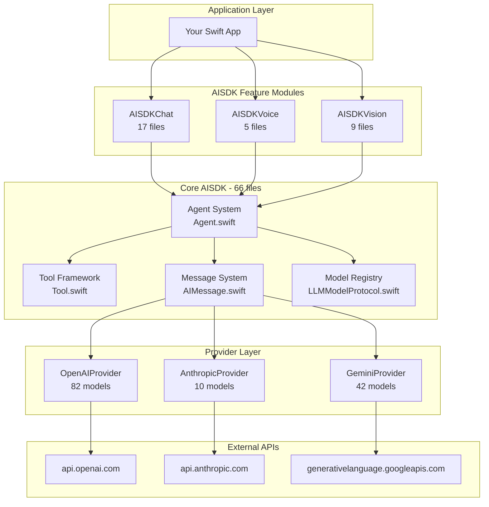
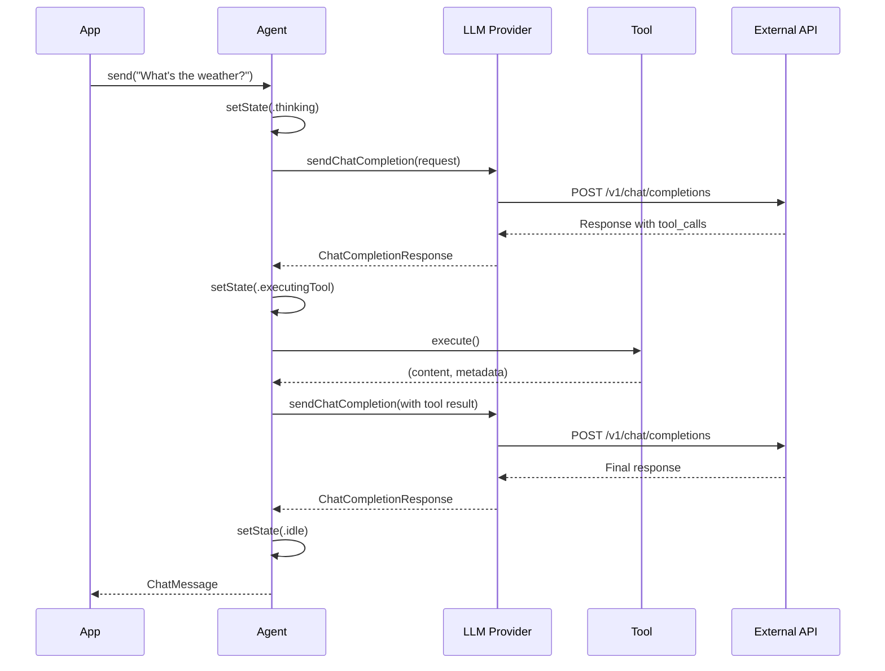
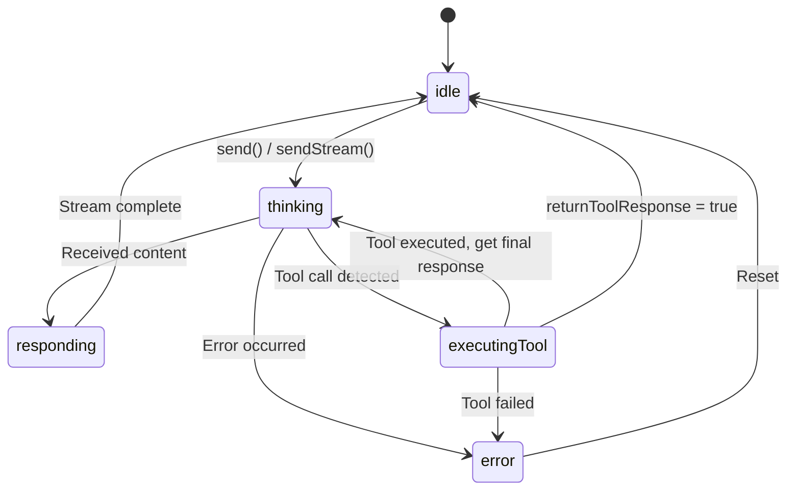
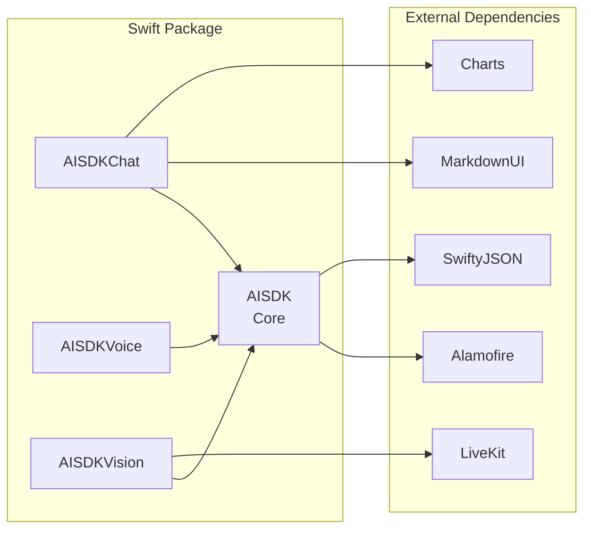
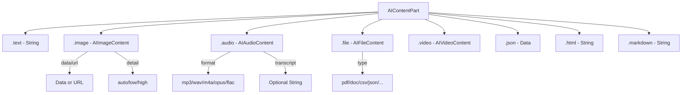
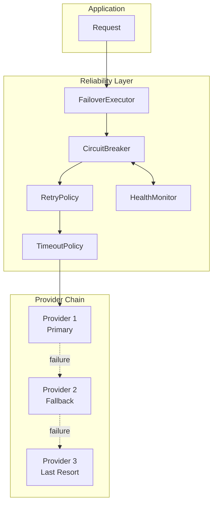
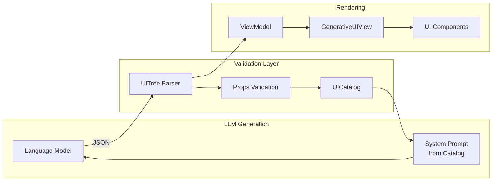

# AISDK Architecture Documentation

> **Version:** 2.0.0 | **Last Updated:** January 2025 | **Swift:** 5.9+ | **Platforms:** iOS 17+, macOS 14+, watchOS 10+, tvOS 17+

---

## Quick Reference

| Component | Purpose | Key Types |
|-----------|---------|-----------|
| **Core AISDK** | Multi-provider LLM abstraction | `AIAgentActor`, `AILanguageModel`, `AITool`, `AIMessage` |
| **Providers** | API implementations | `OpenRouterClient`, `LiteLLMClient`, `OpenAIProvider` |
| **Reliability** | Fault tolerance | `AdaptiveCircuitBreaker`, `FailoverExecutor`, `ProviderHealthMonitor` |
| **Generative UI** | LLM-generated interfaces | `UICatalog`, `UITree`, `GenerativeUIViewModel` |
| **Tools** | Function calling framework | `AITool`, `AIToolResult`, `AIToolRegistry` |
| **Messages** | Universal message format | `AIMessage`, `AITextRequest`, `AITextResult` |

---

## Table of Contents

1. [Executive Summary](#1-executive-summary)
2. [Architecture Overview](#2-architecture-overview)
3. [Provider System](#3-provider-system)
4. [Module Breakdown](#4-module-breakdown)
5. [Message System](#5-message-system)
6. [Tool Framework](#6-tool-framework)
7. [Agent System](#7-agent-system)
8. [Model Registry](#8-model-registry)
9. [API Surface Reference](#9-api-surface-reference)
10. [Gap Analysis](#10-gap-analysis)
11. [Reliability Layer](#11-reliability-layer)
12. [Generative UI](#12-generative-ui)
13. [Testing Infrastructure](#13-testing-infrastructure)
14. [AISDK 2.0 Modernization](#14-aisdk-20-modernization)
15. [File Index](#15-file-index)

---

## 1. Executive Summary

AISDK is a production-grade, multi-provider AI SDK for Swift that abstracts multiple LLM providers behind unified protocols and APIs.

### Key Statistics

- **66 Swift files** in core module
- **134+ models** across 3 major providers
- **4 modules**: Core, Chat, Vision, Voice
- **31+ capability flags** for model classification

### Supported Providers

| Provider | Models | Key Features |
|----------|--------|--------------|
| **OpenAI** | 82 models | GPT-5, GPT-4o, o3/o4 reasoning, DALL-E, Whisper, Responses API |
| **Anthropic** | 10 models | Claude 4, Claude 3.7/3.5, extended thinking |
| **Google** | 42 models | Gemini 2.5/2.0, Imagen 4.0, Veo 2.0, Live API |

### Core Capabilities

- **Streaming**: Full SSE streaming with real-time chunks
- **Tools/Function Calling**: Type-safe tool framework with JSON Schema generation
- **Agents**: Orchestrated tool execution with state management
- **Multimodal**: Text, images, audio, video, files
- **Structured Output**: JSON schema validation with `generateObject<T>()`

---

## 2. Architecture Overview

### High-Level Architecture



### Message Flow



### Agent State Machine



---

## 3. Provider System

### 3.1 OpenAIProvider

**File:** `Sources/AISDK/LLMs/OpenAI/OpenAIProvider.swift`

The primary provider with the most comprehensive feature set.

```swift
// Model-aware initialization (recommended)
let openai = OpenAIProvider(
    model: OpenAIModels.gpt4o,
    apiKey: "sk-..."  // Falls back to OPENAI_API_KEY env var
)

// Legacy initialization
let openai = OpenAIProvider(apiKey: "sk-...")
```

**Supported Operations:**

| Method | Description |
|--------|-------------|
| `sendChatCompletion(request:)` | Non-streaming chat completion |
| `sendChatCompletionStream(request:)` | SSE streaming completion |
| `generateObject<T>(request:)` | Structured output with JSON Schema |
| `createResponse(request:)` | Responses API (non-streaming) |
| `createResponseStream(request:)` | Responses API (streaming) |
| `createResponseWithWebSearch(...)` | Web search tool |
| `createResponseWithCodeInterpreter(...)` | Code interpreter tool |

**Example: Streaming Chat**

```swift
let request = ChatCompletionRequest(
    model: "gpt-4o",
    messages: [Message.user(content: .text("Hello!"))],
    stream: true
)

for try await chunk in openai.sendChatCompletionStream(request: request) {
    if let content = chunk.choices.first?.delta.content {
        print(content, terminator: "")
    }
}
```

### 3.2 AnthropicProvider

**File:** `Sources/AISDK/LLMs/Anthropic/AnthropicProvider.swift`

Uses Anthropic's OpenAI compatibility layer with automatic parameter normalization.

```swift
let claude = AnthropicProvider(
    apiKey: "sk-ant-...",
    baseUrl: "https://api.anthropic.com/v1"
)
```

**Compatibility Notes:**
- `n` must be 1 (automatically enforced)
- `temperature` capped at 1.0
- Ignored parameters: `logprobs`, `presence_penalty`, `frequency_penalty`, `seed`

**Example: Extended Thinking**

```swift
let request = claude.withExtendedThinking(
    request: baseRequest,
    budgetTokens: 2000
)
let response = try await claude.sendChatCompletion(request: request)
```

### 3.3 GeminiProvider

**File:** `Sources/AISDK/LLMs/Gemini/GeminiProvider.swift`

URLSession-based provider with retry logic and file upload support.

```swift
let gemini = GeminiProvider(
    model: GeminiModels.gemini25Flash,
    apiKey: "...",  // Falls back to GOOGLE_API_KEY or GEMINI_API_KEY
    maxRetries: 3,
    retryDelay: 1.0
)
```

**Unique Features:**

| Method | Description |
|--------|-------------|
| `generateContentRequest(...)` | Standard generation |
| `generateStreamingContentRequest(...)` | Streaming generation |
| `makeImagenRequest(...)` | Image generation with Imagen |
| `uploadFile(fileData:mimeType:)` | File upload for context |
| `deleteFile(fileURL:)` | Delete uploaded files |
| `getStatus(fileURL:)` | Check file processing status |

---

## 4. Module Breakdown

### Module Dependencies



### 4.1 Core AISDK (66 files)

The foundation layer providing LLM abstraction.

| Directory | Files | Purpose |
|-----------|-------|---------|
| `Agents/` | 9 | Agent orchestration, state management, callbacks |
| `LLMs/` | 52 | Provider implementations, API models, protocols |
| `Tools/` | 2 | Tool framework and registry |
| `Models/` | 3 | ChatMessage, AIMessage, Attachment |
| `Errors/` | 1 | Error types (AISDKError, LLMError, AgentError) |
| `Utilities/` | 3 | ConfigManager, JSON utilities |
| `Speech/` | 1 | SpeechRecognizer |

### 4.2 AISDKChat (17 files)

Text conversation management with SwiftUI components.

**Key Types:**
- `AIChatManager` - Session and conversation state
- `ChatSession` - Conversation container with Firestore sync
- `ChatMessage` - Message with metadata, attachments, feedback

**Features:**
- Session lifecycle management
- Real-time streaming UI updates
- Health profile integration
- Suggested questions generation
- Image/file attachments with Firebase upload

### 4.3 AISDKVoice (5 files)

Speech recognition and text-to-speech integration.

**Key Types:**
- `AIVoiceMode` - Core engine for voice conversations
- `VoiceActivityDetector` - Silence detection for auto-processing

**Modes:**
1. `.conversation` - Standard health companion interaction
2. `.questionnaire` - Structured health assessment
3. `.observer` - Context-aware triggered mode

### 4.4 AISDKVision (9 files)

Real-time video streaming with LiveKit.

**Key Types:**
- `ChatContext` - LiveKit Room connection manager
- `TokenService` - Connection token management
- `OrbAudioVisualizer` - Real-time audio visualization

---

## 5. Message System

### Universal Message Format

**File:** `Sources/AISDK/Models/AIMessage.swift`

The `AIInputMessage` provides a provider-agnostic message format that converts to specific LLM formats.

```swift
// Simple text message
let message = AIInputMessage.user("What's the weather?")

// Multimodal message with image
let imageMessage = AIInputMessage.user([
    .text("What's in this image?"),
    .image(imageData, detail: .high, mimeType: "image/jpeg")
])

// System message
let systemMessage = AIInputMessage.system("You are a helpful assistant.")

// Tool response
let toolResponse = AIInputMessage.tool(
    "72°F and sunny",
    callId: "call_123",
    name: "get_weather"
)
```

### Content Part Types



### Provider Conversions

The SDK automatically converts `AIInputMessage` to provider-specific formats:

| Provider | Conversion File | Target Format |
|----------|-----------------|---------------|
| OpenAI | `AIMessage+ChatConversions.swift` | `Message` |
| OpenAI Responses | `AIMessage+ResponseConversions.swift` | `ResponseInput` |
| Anthropic | `AIMessage+AnthropicConversions.swift` | Anthropic format |
| Gemini | `AIMessage+GeminiConversions.swift` | Gemini content parts |

---

## 6. Tool Framework

### Tool Protocol

**File:** `Sources/AISDK/Tools/Tool.swift`

```swift
public protocol Tool {
    var name: String { get }
    var description: String { get }
    var returnToolResponse: Bool { get }  // Skip LLM interpretation if true

    init()
    static func jsonSchema() -> ToolSchema
    func execute() async throws -> (content: String, metadata: ToolMetadata?)
    mutating func setParameters(from arguments: [String: Any]) throws
    mutating func validateAndSetParameters(_ argumentsData: Data) throws -> Self
}
```

### @Parameter Property Wrapper

```swift
@propertyWrapper
public class Parameter<Value> {
    public let description: String
    public var wrappedValue: Value
    public var validation: [String: Any]?

    // Type inference for JSON Schema
    internal static func inferType(from valueType: Any.Type) -> JSONType
}
```

### Complete Tool Example

```swift
class WeatherTool: Tool {
    let name = "get_weather"
    let description = "Get current weather for a city"

    @Parameter(description: "City name (e.g., San Francisco)")
    var city: String = ""

    @Parameter(
        description: "Temperature unit",
        validation: ["enum": ["celsius", "fahrenheit"]]
    )
    var unit: String = "fahrenheit"

    required init() {}

    func execute() async throws -> (String, ToolMetadata?) {
        // Fetch weather data...
        let result = "Weather in \(city): 72°F, sunny"
        return (result, nil)
    }
}

// Generated JSON Schema:
// {
//   "type": "function",
//   "function": {
//     "name": "get_weather",
//     "description": "Get current weather for a city",
//     "parameters": {
//       "type": "object",
//       "properties": {
//         "city": { "type": "string", "description": "City name (e.g., San Francisco)" },
//         "unit": { "type": "string", "description": "Temperature unit", "enum": ["celsius", "fahrenheit"] }
//       },
//       "required": ["city", "unit"]
//     }
//   }
// }
```

### Tool Metadata System

```swift
// Base protocol
public protocol ToolMetadata: Codable {}

// Render metadata for UI
public struct RenderMetadata: ToolMetadata {
    public let toolName: String
    public let jsonData: Data
}

// Fallback for unknown types
public struct RawToolMetadata: ToolMetadata {
    public let originalType: String
    public let payload: AIProxyJSONValue
}

// Register custom metadata types
ToolMetadataDecoderRegistry.register(MyCustomMetadata.self)
```

### RenderableTool Protocol

```swift
public protocol RenderableTool: Tool {
    func render(from data: Data) -> AnyView
}
```

---

## 7. Agent System

### Agent Class

**File:** `Sources/AISDK/Agents/Agent.swift`

The Agent orchestrates LLM interactions with automatic tool execution.

```swift
// Initialize with provider
let agent = Agent(
    llm: openai,
    tools: [WeatherTool.self, CalculatorTool.self],
    messages: [],
    instructions: "You are a helpful assistant."
)

// State change callback for UI
agent.onStateChange = { state in
    switch state {
    case .idle: print("Ready")
    case .thinking: print("Processing...")
    case .responding: print("Generating response...")
    case .executingTool(let name): print("Running \(name)...")
    case .error(let error): print("Error: \(error)")
    }
}
```

### Synchronous Send

```swift
// Wait for complete response
let response = try await agent.send("What's the weather in Tokyo?")
print(response.message)  // Full response with tool results
```

### Streaming Send

```swift
// Stream responses for real-time UI updates
let userMessage = ChatMessage(message: .user(content: .text("Tell me about...")))

for try await message in agent.sendStream(userMessage) {
    if message.isPending {
        // Partial response - update UI
        updateUI(message.displayContent)
    } else {
        // Final response
        showFinalMessage(message)
    }
}
```

### Agent Callbacks

**File:** `Sources/AISDK/Agents/AgentCallbacks.swift`

```swift
public enum CallbackResult {
    case cancel
    case replace(Message)
    case `continue`
}

public protocol AgentCallbacks: AnyObject {
    func onMessageReceived(message: Message) async -> CallbackResult
    func onBeforeLLMRequest(messages: [Message]) async -> CallbackResult
    func onStreamChunk(chunk: Message) async -> CallbackResult
    func onBeforeToolExecution(name: String, arguments: String) async -> CallbackResult
    func onAfterToolExecution(name: String, result: String) async -> CallbackResult
}

// Register callbacks
agent.addCallbacks(myCallbackHandler)
```

---

## 8. Model Registry

### LLMModelProtocol

**File:** `Sources/AISDK/LLMs/LLMModelProtocol.swift`

```swift
public protocol LLMModelProtocol: LLMCapable, LLMModelIdentifiable, LLMModelPerformance {
    var id: String { get }
    var name: String { get }
    var displayName: String { get }
    var description: String { get }
    var provider: LLMProvider { get }
    var category: LLMUsageCategory { get }
    var versionType: LLMVersionType { get }
    var capabilities: LLMCapabilities { get }
    var tier: LLMPerformanceTier? { get }
    var inputTokenLimit: Int? { get }
    var outputTokenLimit: Int? { get }
    var knowledgeCutoff: String? { get }
}
```

### Capability Flags (31+)

```swift
public struct LLMCapabilities: OptionSet {
    // Input/Output Modalities
    static let text              // Text generation
    static let vision            // Image understanding
    static let audio             // Audio input
    static let video             // Video understanding
    static let pdf               // PDF processing

    // Functional Capabilities
    static let tools             // Tool/function calling
    static let functionCalling   // Legacy function calling
    static let codeExecution     // Code interpreter
    static let structuredOutputs // JSON schema outputs
    static let jsonMode          // JSON response format

    // Advanced Capabilities
    static let reasoning         // Extended reasoning (o1, o3)
    static let thinking          // Visible thinking process
    static let search            // Search integration
    static let webSearch         // Web search
    static let grounding         // Grounded responses

    // Generation Capabilities
    static let imageGeneration   // DALL-E, Imagen
    static let audioGeneration   // Text-to-speech
    static let videoGeneration   // Veo
    static let speechToText      // Whisper
    static let textToSpeech      // TTS

    // Operational Capabilities
    static let streaming         // Streaming responses
    static let realtime          // Real-time API
    static let liveAPI           // Live interaction
    static let caching           // Prompt caching
    static let tuning            // Fine-tuning
    static let embedding         // Embeddings

    // Special Features
    static let moderation        // Content moderation
    static let computerUse       // Computer control
    static let multilingual      // Multi-language
    static let longContext       // Extended context
    static let deprecated        // Deprecated model
}
```

### Performance Tiers

```swift
public enum LLMPerformanceTier: Comparable {
    case nano      // Smallest, fastest, cheapest
    case mini      // Small, fast
    case small     // Balanced small
    case medium    // Balanced
    case large     // High capability
    case pro       // Professional grade
    case ultra     // Highest capability
    case flagship  // Best available
}
```

### Model Collections

```swift
// OpenAI Models (82 total)
OpenAIModels.gpt5          // gpt-5
OpenAIModels.gpt5Mini      // gpt-5-mini
OpenAIModels.gpt4o         // gpt-4o
OpenAIModels.o3            // o3 reasoning
OpenAIModels.o4Mini        // o4-mini
OpenAIModels.dalle3        // dall-e-3

// Anthropic Models (10 total)
AnthropicModels.claudeOpus4      // claude-opus-4-20250514
AnthropicModels.claudeSonnet4    // claude-sonnet-4-20250514
AnthropicModels.claude37Sonnet   // claude-3-7-sonnet-20250219
AnthropicModels.claude35Sonnet   // claude-3-5-sonnet-20241022

// Gemini Models (42 total)
GeminiModels.gemini25Pro         // gemini-2.5-pro
GeminiModels.gemini25Flash       // gemini-2.5-flash
GeminiModels.gemini20Flash       // gemini-2.0-flash
GeminiModels.imagen4             // imagen-4.0-generate
```

---

## 9. API Surface Reference

### Provider Initialization

```swift
// OpenAI - Model-aware (recommended)
let openai = OpenAIProvider(
    model: OpenAIModels.gpt4o,
    apiKey: "sk-...",
    baseUrl: "https://api.openai.com",
    session: .default
)

// Anthropic
let claude = AnthropicProvider(
    apiKey: "sk-ant-...",
    baseUrl: "https://api.anthropic.com/v1",
    session: .default
)

// Gemini
let gemini = GeminiProvider(
    model: GeminiModels.gemini25Flash,
    apiKey: "...",
    maxRetries: 3,
    retryDelay: 1.0
)
```

### Chat Completion

```swift
// Build request
let request = ChatCompletionRequest(
    model: "gpt-4o",
    messages: [
        Message.system(content: .text("You are helpful")),
        Message.user(content: .text("Hello!"))
    ],
    temperature: 0.7,
    maxTokens: 1000,
    tools: [WeatherTool.jsonSchema()],
    toolChoice: .auto,
    parallelToolCalls: true
)

// Non-streaming
let response = try await openai.sendChatCompletion(request: request)
let content = response.choices.first?.message.content

// Streaming
for try await chunk in openai.sendChatCompletionStream(request: request) {
    print(chunk.choices.first?.delta.content ?? "", terminator: "")
}
```

### Structured Output

```swift
struct FruitList: Codable {
    let fruits: [Fruit]

    struct Fruit: Codable {
        let name: String
        let color: String
    }
}

let request = ChatCompletionRequest(
    model: "gpt-4o",
    messages: [...],
    responseFormat: .jsonSchema(
        name: "fruit_list",
        description: "A list of fruits",
        schemaBuilder: FruitList.schema(),
        strict: true
    )
)

let fruits: FruitList = try await openai.generateObject(request: request)
```

### Agent Usage

```swift
// Create agent
let agent = Agent(
    llm: openai,
    tools: [WeatherTool.self, SearchTool.self],
    instructions: "You are a helpful assistant."
)

// Simple send
let response = try await agent.send("What's the weather in NYC?")

// Streaming with tool execution
for try await message in agent.sendStream(userMessage) {
    updateUI(message)
}

// Conversation management
agent.setMessages(previousMessages)
```

### Error Handling

```swift
do {
    let response = try await agent.send("...")
} catch let error as LLMError {
    switch error {
    case .authenticationError:
        print("Invalid API key")
    case .rateLimitExceeded:
        print("Rate limited - retry later")
    case .networkError(let code, let message):
        print("Network error \(code ?? 0): \(message)")
    case .parsingError(let details):
        print("Parse failed: \(details)")
    default:
        print("LLM error: \(error)")
    }
} catch let error as AgentError {
    switch error {
    case .toolExecutionFailed(let reason):
        print("Tool failed: \(reason)")
    case .operationCancelled:
        print("Cancelled by callback")
    default:
        print("Agent error: \(error)")
    }
}
```

---

## 10. Gap Analysis

### Missing Features vs Industry Standards

| Feature | AISDK Status | OpenAI SDK | Anthropic SDK | Vercel AI SDK | Gap Description |
|---------|--------------|------------|---------------|---------------|-----------------|
| **Prompt Caching** | Missing | Supported | Supported | Supported | No implementation for prompt caching to reduce costs |
| **Batching API** | Missing | Supported | Supported | N/A | No batch endpoint for async bulk processing |
| **Embeddings API** | Models only | Full | Full | Full | Model definitions exist but no `embed()` method |
| **PDF Support** | Missing | Supported | Supported | N/A | No native PDF handling in message system |
| **Token Counting** | Missing | tiktoken | Included | Included | No pre-request token estimation |
| **Rate Limiting** | Basic | Full | Full | Full | No automatic backoff or retry-after handling |
| **Retry Logic** | Gemini only | All | All | All | Inconsistent - only GeminiProvider has retries |
| **Computer Use** | Missing | N/A | Supported | N/A | No Anthropic computer use tool integration |
| **MCP Support** | Partial | N/A | Full | N/A | Basic MCP types but incomplete implementation |
| **Context Caching** | Missing | N/A | N/A | Supported (Gemini) | No Gemini context caching integration |
| **Cancellation** | Basic | Full | Full | Full | Stream cancellation works but no request cancellation |
| **Telemetry** | Missing | Optional | Optional | Built-in | No observability or tracing support |

### Provider-Specific Gaps

**OpenAI:**
- Missing: Assistants API, Files API, Fine-tuning API, Batch API
- Missing: Audio transcription/translation endpoints
- Missing: Image edit/variation endpoints

**Anthropic:**
- Missing: Native Messages API (uses OpenAI compatibility layer)
- Missing: Message Batches API
- Missing: Prompt caching headers

**Gemini:**
- Missing: Context caching API
- Missing: Grounding with Google Search
- Missing: Safety settings configuration

### Architecture Gaps

| Area | Current State | Industry Standard |
|------|---------------|-------------------|
| **Protocol Conformance** | GeminiProvider uses separate `GeminiService` protocol | Should conform to `LLM` protocol directly |
| **Error Standardization** | Multiple error types (AISDKError, LLMError, AgentError) | Single unified error type |
| **Logging** | Print statements | Structured logging with levels |
| **Configuration** | Environment variables only | Configuration objects with validation |
| **Testing** | Mock providers available | Dependency injection throughout |

---

## 11. Reliability Layer

AISDK 2.0 introduces a comprehensive reliability layer for production-grade fault tolerance.

### Architecture Overview



### 11.1 AdaptiveCircuitBreaker

**File:** `Sources/AISDK/Core/Reliability/AdaptiveCircuitBreaker.swift`

Actor-based circuit breaker with adaptive failure detection.

```swift
// Create circuit breaker
let breaker = AdaptiveCircuitBreaker(configuration: .default)

// Execute with circuit breaker protection
do {
    let result = try await breaker.execute {
        try await provider.makeRequest()
    }
} catch CircuitBreakerError.circuitOpen(let until) {
    // Handle circuit open - use fallback provider
}
```

**States:**

| State | Description | Traffic |
|-------|-------------|---------|
| `closed` | Normal operation, failures counted | Allowed |
| `open(until:)` | Provider failing, requests rejected | Blocked |
| `halfOpen` | Testing recovery with probe requests | Limited |

**Configuration Presets:**

| Preset | Failure Threshold | Recovery Timeout | Use Case |
|--------|-------------------|------------------|----------|
| `default` | 5 failures | 30 seconds | Standard use |
| `aggressive` | 3 failures | 15 seconds | Critical paths |
| `lenient` | 10 failures | 60 seconds | Unstable providers |

### 11.2 FailoverExecutor

**File:** `Sources/AISDK/Core/Reliability/FailoverExecutor.swift`

Execute requests across a failover chain with integrated reliability features.

```swift
let executor = FailoverExecutorBuilder()
    .with(providers: [openaiClient, anthropicClient])
    .with(healthMonitor: monitor)
    .with(configuration: .default)
    .build()

let result = try await executor.executeRequest(
    request: aiRequest,
    modelId: "gpt-4"
)

print("Handled by: \(result.provider)")
print("Attempts: \(result.attempts)")
print("Latency: \(result.latency)")
```

**Features:**
- Circuit breaker per provider
- Retry policy for transient failures
- Timeout enforcement
- PHI allowlist enforcement
- Health metric recording

### 11.3 FailoverPolicy

**File:** `Sources/AISDK/Core/Reliability/CapabilityAwareFailover.swift`

Capability-aware failover with cost constraints.

```swift
let policy = FailoverPolicy(
    maxCostMultiplier: 5.0,      // Max 5x more expensive
    requireCapabilityMatch: true, // Must match capabilities
    minimumContextWindow: 8000    // Min context required
)

// Check if provider is compatible
let compatible = await policy.isCompatible(
    request: request,
    provider: anthropicClient,
    modelId: "claude-3-sonnet"
)
```

### 11.4 RetryPolicy & TimeoutPolicy

**File:** `Sources/AISDK/Core/Reliability/RetryPolicy.swift`, `TimeoutPolicy.swift`

```swift
// Retry policy with exponential backoff
let retry = RetryPolicy(
    maxAttempts: 3,
    baseDelay: .milliseconds(100),
    maxDelay: .seconds(5),
    backoffMultiplier: 2.0
)

// Timeout policy
let timeout = TimeoutPolicy(
    requestTimeout: .seconds(30),
    streamTimeout: .seconds(120)
)
```

### 11.5 ProviderHealthMonitor

**File:** `Sources/AISDK/Core/Reliability/ProviderHealthMonitor.swift`

Track provider health metrics over time.

```swift
let monitor = ProviderHealthMonitor()

// Record metrics
await monitor.recordLatency(.milliseconds(150), for: "openai")
await monitor.recordError(for: "anthropic")

// Query health status
let status = await monitor.healthStatus(for: "openai")
// Returns: .healthy, .degraded, or .unhealthy
```

---

## 12. Generative UI

AISDK provides a json-render pattern for LLM-generated user interfaces.

### Architecture Overview



### 12.1 UICatalog

**File:** `Sources/AISDK/GenerativeUI/Catalog/UICatalog.swift`

Central registry for UI component definitions.

```swift
// Use the default Core 8 catalog
let catalog = UICatalog.core8

// Generate system prompt for LLM
let prompt = catalog.generatePrompt()

// Validate a component
try catalog.validate(type: "Button", propsData: jsonData)
```

**Core 8 Components:**

| Component | Description | Has Children |
|-----------|-------------|--------------|
| `Text` | Display text content | No |
| `Button` | Interactive button | No |
| `Card` | Container with title/subtitle | Yes |
| `Input` | Text input field | No |
| `List` | Ordered/unordered list | Yes |
| `Image` | Image display | No |
| `Stack` | Layout container | Yes |
| `Spacer` | Flexible space | No |

### 12.2 UITree

**File:** `Sources/AISDK/GenerativeUI/Models/UITree.swift`

Parsed representation of LLM-generated UI.

```swift
// Parse JSON from LLM response
let tree = try UITree.parse(
    from: jsonData,
    validatingWith: UICatalog.core8
)

// Traverse the tree
tree.traverse { node, depth in
    print(String(repeating: "  ", count: depth) + node.type)
}

// Access nodes
let root = tree.rootNode
let children = tree.children(of: root)
```

**JSON Format:**

```json
{
  "root": "main",
  "elements": {
    "main": {
      "type": "Stack",
      "props": { "direction": "vertical" },
      "children": ["title", "button"]
    },
    "title": {
      "type": "Text",
      "props": { "content": "Hello, World!" }
    },
    "button": {
      "type": "Button",
      "props": { "title": "Click Me", "action": "submit" }
    }
  }
}
```

**Validation:**
- Structural (valid keys, no cycles, true tree structure)
- Component type validation against catalog
- Props validation per component
- Depth limit: 100 levels
- Node limit: 10,000 nodes

### 12.3 GenerativeUIViewModel

**File:** `Sources/AISDK/GenerativeUI/ViewModels/GenerativeUIViewModel.swift`

Observable view model for SwiftUI integration with batched updates.

```swift
let viewModel = GenerativeUIViewModel(catalog: .core8)

// Update from LLM response (batched)
try await viewModel.updateTree(from: jsonData)

// SwiftUI usage
struct ContentView: View {
    @StateObject var viewModel: GenerativeUIViewModel

    var body: some View {
        GenerativeUIView(viewModel: viewModel)
    }
}
```

### 12.4 Custom Component Definition

Create custom components by conforming to `UIComponentDefinition`:

```swift
// Define props
struct MyCardProps: Codable, Sendable {
    let title: String
    let subtitle: String?
    let imageURL: String?
}

// Define component
struct MyCardDefinition: UIComponentDefinition {
    typealias Props = MyCardProps

    static let type = "MyCard"
    static let description = "A custom card with image support"
    static let hasChildren = true
    static let propsSchemaDescription = """
        title (required): Card title
        subtitle (optional): Card subtitle
        imageURL (optional): URL for card image
        """

    static func validate(props: Props) throws {
        if props.title.isEmpty {
            throw UIComponentValidationError.invalidPropValue(
                component: type,
                prop: "title",
                reason: "Title cannot be empty"
            )
        }
    }
}

// Register in catalog
var catalog = UICatalog.core8
try catalog.register(MyCardDefinition.self)
```

---

## 13. Testing Infrastructure

AISDK provides comprehensive testing utilities.

### 13.1 MockAILanguageModel

**File:** `Tests/AISDKTests/Mocks/MockAILanguageModel.swift`

Configurable mock for unit testing.

```swift
let mock = MockAILanguageModel(
    responses: [
        .text("Hello, I'm a mock!"),
        .toolCall(name: "get_weather", arguments: "{}"),
        .text("Final response")
    ]
)

let agent = AIAgentActor(model: mock, tools: [])
let result = try await agent.execute(messages: [.user("Test")])
```

### 13.2 Stress Testing Patterns

**File:** `Tests/AISDKTests/Stress/ConcurrencyStressTests.swift`

```swift
// Run 100+ concurrent agent executions
func test_concurrent_agent_executions() async throws {
    let metrics = StressTestMetrics()

    await withTaskGroup(of: Void.self) { group in
        for _ in 0..<100 {
            group.addTask {
                let agent = AIAgentActor(model: mock, tools: [])
                do {
                    _ = try await agent.execute(messages: [.user("Test")])
                    metrics.recordCompletion()
                } catch {
                    metrics.recordError(error)
                }
            }
        }
    }

    XCTAssertGreaterThan(metrics.completedCount, 90)
}
```

### 13.3 Memory Leak Detection

**File:** `Tests/AISDKTests/Memory/StreamMemoryTests.swift`

```swift
func test_stream_deallocation() async throws {
    var weakRefs: [WeakRef<Model>] = []

    for _ in 0..<100 {
        let model = MemoryTestMockModel()
        weakRefs.append(WeakRef(model))

        Task {
            for try await _ in model.streamText(request: request) { }
        }
    }

    try await Task.sleep(for: .milliseconds(100))

    let aliveCount = weakRefs.filter { $0.value != nil }.count
    XCTAssertLessThanOrEqual(aliveCount, 10)
}
```

### 13.4 Real API Integration Tests

**File:** `Tests/AISDKTests/Stress/OpenRouterStressTests.swift`

Tests against real providers with free models (skipped without API key).

```swift
func test_concurrent_streaming_requests() async throws {
    let client = try createClient()  // Skips if no API key

    await withTaskGroup(of: Void.self) { group in
        for i in 0..<5 {
            group.addTask {
                let request = ProviderRequest(
                    modelId: "google/gemma-3-4b-it:free",
                    messages: [.user("Count to 3")]
                )
                for try await _ in client.stream(request: request) { }
            }
        }
    }
}
```

---

## 14. AISDK 2.0 Modernization

### Key Changes in 2.0

| Feature | 1.x | 2.0 |
|---------|-----|-----|
| Agent Implementation | Class-based | Actor-based (`AIAgentActor`) |
| Concurrency | GCD/Closures | Swift Concurrency |
| Streaming | Completion handlers | `AsyncThrowingStream` |
| State Management | KVO | `@Observable` pattern |
| Provider Reliability | None | Full circuit breaker + failover |
| Generative UI | None | json-render pattern |

### Migration Adapters

**File:** `Sources/AISDK/Adapters/`

Adapters bridge legacy code to modern APIs:

```swift
// Wrap legacy LLM with modern protocol
let legacyProvider = OldStyleLLM()
let adapted = AILanguageModelAdapter(legacyLLM: legacyProvider)

// Now use with modern agent
let agent = AIAgentActor(model: adapted, tools: [])
```

### AIAgentActor

The modern, actor-based agent implementation:

```swift
// Create agent with modern API
let agent = AIAgentActor(
    model: openRouterModel,
    tools: [weatherTool, calculatorTool],
    systemPrompt: "You are a helpful assistant"
)

// Execute (non-streaming)
let result = try await agent.execute(messages: [.user("Hello")])

// Stream execution
for try await event in agent.streamExecute(messages: [.user("Count to 5")]) {
    switch event {
    case .textDelta(let text):
        print(text, terminator: "")
    case .toolCallStart(let name):
        print("\n[Calling \(name)]")
    case .finish:
        print("\n[Done]")
    default:
        break
    }
}
```

### Observable Agent State

```swift
@Observable
final class ObservableAgentState {
    var isProcessing: Bool = false
    var currentTool: String? = nil
    var error: Error? = nil
    var messages: [AIMessage] = []
}

// SwiftUI binding
struct ChatView: View {
    @State var agentState = ObservableAgentState()

    var body: some View {
        if agentState.isProcessing {
            ProgressView()
        }
        // ...
    }
}
```

---

## 15. File Index

### Sources/AISDK/ (66 files)

#### Root
| File | Purpose |
|------|---------|
| `AISDK.swift` | Package entry point and re-exports |

#### Agents/ (9 files)
| File | Purpose |
|------|---------|
| `Agent.swift` | Main agent class with LLM orchestration |
| `AgentState.swift` | State enum (idle, thinking, responding, executingTool, error) |
| `AgentCallbacks.swift` | Callback protocol for lifecycle hooks |
| `ResponseAgent.swift` | Specialized agent for OpenAI Responses API |
| `ResponseAgentError.swift` | Response agent error types |
| `ResearchAgent/Agent/ExperimentalResearchAgent.swift` | Experimental research agent |
| `ResearchAgent/Agent/ResearcherAgentState.swift` | Research agent states |
| `ResearchAgent/Models/ResearchMetadata.swift` | Research operation metadata |

#### Errors/ (1 file)
| File | Purpose |
|------|---------|
| `AISDKError.swift` | Error types: AISDKError, LLMError, AgentError, ToolError |

#### LLMs/ (52 files)
| File | Purpose |
|------|---------|
| `LLMProtocol.swift` | Core `LLM` protocol |
| `LLMModelProtocol.swift` | Model capabilities and metadata protocols |
| `AgenticModels.swift` | Legacy model definitions |

**LLMs/OpenAI/** (22 files)
| File | Purpose |
|------|---------|
| `OpenAIProvider.swift` | Main OpenAI provider implementation |
| `OpenAIProvider+Retry.swift` | Retry logic extension |
| `OpenAIProvider+Response.swift` | Responses API extension |
| `OpenAIModels.swift` | 82 OpenAI model definitions |
| `APIModels/ChatCompletion/ChatCompletionRequest.swift` | Request structure |
| `APIModels/ChatCompletion/ChatCompletionResponse.swift` | Response structure |
| `APIModels/ChatCompletion/ChatCompletionChunk.swift` | Streaming chunk |
| `APIModels/ChatCompletion/Message.swift` | Message types |
| `APIModels/ChatCompletion/AIMessage+ChatConversions.swift` | Universal → OpenAI |
| `APIModels/Responses/ResponseRequest.swift` | Responses API request |
| `APIModels/Responses/ResponseObject.swift` | Response object |
| `APIModels/Responses/ResponseChunk.swift` | Streaming response chunk |
| `APIModels/Responses/ResponseTool.swift` | Response tool definitions |
| `APIModels/Responses/ResponseTypes.swift` | Shared types |
| `APIModels/Responses/ResponseSession.swift` | Session tracking |
| `APIModels/Responses/AIMessage+ResponseConversions.swift` | Universal → Response |
| `APIModels/TextToSpeechQuery.swift` | TTS request |

**LLMs/Anthropic/** (11 files)
| File | Purpose |
|------|---------|
| `AnthropicProvider.swift` | OpenAI-compatible Anthropic provider |
| `AnthropicService.swift` | Native Anthropic service |
| `AnthropicModels.swift` | 10 Claude model definitions |
| `AnthropicMessageRequestBody.swift` | Request structure |
| `AnthropicMessageResponseBody.swift` | Response structure |
| `AnthropicMessageStreamingChunk.swift` | Streaming chunk |
| `AnthropicMessageStreamingContentBlockStart.swift` | Content block events |
| `AnthropicMessageStreamingDeltaBlock.swift` | Delta events |
| `AnthropicAsyncChunks.swift` | Async stream handling |
| `AIMessage+AnthropicConversions.swift` | Universal → Anthropic |
| `AnthropicMCPServer.swift` | MCP server support |
| `AnthropicMCPContentBlocks.swift` | MCP content blocks |

**LLMs/Gemini/** (12 files)
| File | Purpose |
|------|---------|
| `GeminiProvider.swift` | Main Gemini provider |
| `GeminiService.swift` | Service protocol |
| `GeminiModels.swift` | 42 Gemini model definitions |
| `GeminiGenerateContentRequestBody.swift` | Request structure |
| `GeminiGenerateContentResponseBody.swift` | Response structure |
| `GeminiImagenRequestBody.swift` | Imagen request |
| `GeminiImagenResponseBody.swift` | Imagen response |
| `GeminiFileUploadRequestBody.swift` | File upload request |
| `GeminiFileUploadResponseBody.swift` | File upload response |
| `GeminiFile.swift` | File metadata |
| `GeminiError.swift` | Gemini-specific errors |
| `AIMessage+GeminiConversions.swift` | Universal → Gemini |

#### Models/ (3 files)
| File | Purpose |
|------|---------|
| `AIMessage.swift` | Universal message format (AIInputMessage, AIContentPart) |
| `ChatMessage.swift` | Application-level message with metadata |
| `Attachment.swift` | File attachment support |
| `MedicalRecord.swift` | Domain-specific model |

#### Speech/ (1 file)
| File | Purpose |
|------|---------|
| `SpeechRecognizer.swift` | Speech recognition wrapper |

#### Tools/ (2 files)
| File | Purpose |
|------|---------|
| `Tool.swift` | Tool protocol, @Parameter, ToolMetadata |
| `ToolRegistry.swift` | Tool type registry |

#### Utilities/ (3 files)
| File | Purpose |
|------|---------|
| `ConfigManager.swift` | Environment variable management |
| `JSONSchemaRepresentable.swift` | JSON schema generation protocol |
| `AIProxyJSONValue.swift` | Dynamic JSON value handling |

---

### Examples/ (4 directories)

| Directory | Purpose |
|-----------|---------|
| `BasicChatDemo/main.swift` | CLI demo: chat, streaming, images, structured output |
| `ToolDemo/main.swift` | Tool framework demonstration |
| `OpenRouterDemo/main.swift` | CLI demo: OpenRouter chat, streaming, JSON, tools |
| `Demos/` | SwiftUI demo views |

### Tests/AISDKTests/ (69 tests)

| Category | Tests | Focus |
|----------|-------|-------|
| Tool Tests | 19 | Schema generation, parameter handling, execution |
| Agent Integration | 13 | Send, stream, tools, callbacks, metadata |
| Basic Chat | 10 | Provider validation, token usage, auth |
| Streaming | 8 | SSE, chunks, concurrent, interruption |
| Multimodal | 8 | Images, base64, multiple images |
| Structured Output | 6 | JSON schema, object generation, types |
| OpenRouter Integration | 5 | Chat, streaming, JSON, tools, reasoning |

---

## Appendix: Dependencies

| Package | Version | Purpose |
|---------|---------|---------|
| Alamofire | 5.8.0+ | HTTP networking (OpenAI, Anthropic) |
| SwiftyJSON | 5.0.0+ | JSON handling |
| MarkdownUI | 2.0.0+ | Chat message rendering |
| Charts | 5.0.0+ | Data visualization |
| LiveKit | 2.0.0+ | Real-time video (Vision module) |

---

*This documentation reflects AISDK 2.0 architecture. Last updated: January 2025*
