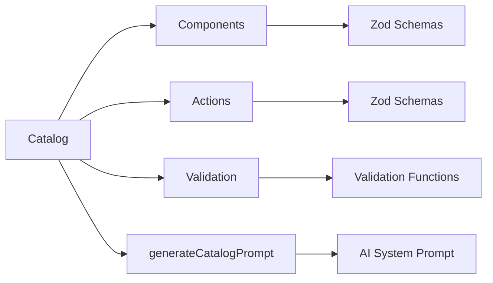

# json-render Catalog System Reference

This document covers the catalog system in json-render, which defines the components, actions, and validation functions available to AI models.

## Table of Contents

- [Overview](#overview)
- [Creating a Catalog](#creating-a-catalog)
- [Component Definitions](#component-definitions)
- [Action Definitions](#action-definitions)
- [Validation Functions](#validation-functions)
- [Generating AI Prompts](#generating-ai-prompts)
- [Catalog Validation](#catalog-validation)
- [Advanced Patterns](#advanced-patterns)

## Overview

The catalog is the foundation of json-render's guardrailed approach. It defines:

1. **What components** the AI can use (and their valid props)
2. **What actions** can be triggered (and their payloads)
3. **What validation** is available for form inputs

By constraining the AI to this vocabulary, you ensure it can only generate valid, safe UI.



## Creating a Catalog

Use `createCatalog()` to define your catalog:

```typescript
import { createCatalog, z } from '@json-render/core';

const catalog = createCatalog({
  components: {
    // Component definitions with Zod schemas
  },
  actions: {
    // Action definitions with Zod schemas
  },
  validation: {
    // Validation function factories
  },
});
```

### Type Safety

The catalog is fully typed. TypeScript will infer types for:

- Component props
- Action payloads
- Validation function parameters

```typescript
// Types are automatically inferred
type CardProps = z.infer<typeof catalog.components.card>;
type SubmitPayload = z.infer<typeof catalog.actions.submit>;
```

## Component Definitions

Components are defined using Zod schemas that describe their props.

### Basic Component

```typescript
const catalog = createCatalog({
  components: {
    text: z.object({
      text: z.string(),
      variant: z.enum(['body', 'heading', 'caption']).optional(),
      color: z.string().optional(),
    }),
  },
});
```

### Component with Children

For container components, use a recursive schema:

```typescript
// First, create a base element schema
const baseElement = z.object({
  type: z.string(),
  id: z.string().optional(),
  visible: z.unknown().optional(),
});

// Then reference it in container components
const catalog = createCatalog({
  components: {
    card: z.object({
      title: z.string().optional(),
      subtitle: z.string().optional(),
      children: z.array(z.lazy(() => baseElement)).optional(),
    }),
    row: z.object({
      gap: z.number().optional(),
      align: z.enum(['start', 'center', 'end', 'stretch']).optional(),
      children: z.array(z.lazy(() => baseElement)).optional(),
    }),
  },
});
```

### Component with Data Binding

Props can be static values or dynamic references:

```typescript
const catalog = createCatalog({
  components: {
    userGreeting: z.object({
      // Can be string or { $data: "/path" }
      name: z.union([
        z.string(),
        z.object({ $data: z.string() }),
      ]),
      showAvatar: z.boolean().optional(),
    }),
  },
});
```

### Component with Actions

Components can trigger actions:

```typescript
const catalog = createCatalog({
  components: {
    button: z.object({
      label: z.string(),
      action: z.string(), // References an action type
      disabled: z.boolean().optional(),
      variant: z.enum(['primary', 'secondary', 'danger']).optional(),
    }),
    form: z.object({
      fields: z.array(z.object({
        name: z.string(),
        label: z.string(),
        type: z.enum(['text', 'email', 'number', 'select']),
        validation: z.array(z.string()).optional(),
      })),
      submitAction: z.string(),
      submitLabel: z.string().optional(),
    }),
  },
});
```

### Full Component Example

```typescript
const catalog = createCatalog({
  components: {
    // Layout components
    container: z.object({
      layout: z.enum(['row', 'column', 'grid']).default('column'),
      gap: z.number().default(16),
      padding: z.number().optional(),
      children: z.array(z.lazy(() => baseElement)).optional(),
    }),

    // Display components
    image: z.object({
      src: z.string().url(),
      alt: z.string(),
      width: z.number().optional(),
      height: z.number().optional(),
      rounded: z.boolean().optional(),
    }),

    heading: z.object({
      text: z.string(),
      level: z.enum(['h1', 'h2', 'h3', 'h4']).default('h2'),
    }),

    paragraph: z.object({
      text: z.string(),
      muted: z.boolean().optional(),
    }),

    badge: z.object({
      text: z.string(),
      color: z.enum(['gray', 'red', 'green', 'blue', 'yellow']).default('gray'),
    }),

    // Interactive components
    button: z.object({
      label: z.string(),
      action: z.string(),
      variant: z.enum(['primary', 'secondary', 'outline', 'ghost', 'danger']).default('primary'),
      size: z.enum(['sm', 'md', 'lg']).default('md'),
      disabled: z.boolean().optional(),
      loading: z.boolean().optional(),
    }),

    input: z.object({
      name: z.string(),
      label: z.string(),
      type: z.enum(['text', 'email', 'password', 'number', 'tel', 'url']).default('text'),
      placeholder: z.string().optional(),
      required: z.boolean().optional(),
      validation: z.array(z.string()).optional(),
    }),

    select: z.object({
      name: z.string(),
      label: z.string(),
      options: z.array(z.object({
        value: z.string(),
        label: z.string(),
      })),
      placeholder: z.string().optional(),
      required: z.boolean().optional(),
    }),

    // Data display
    table: z.object({
      columns: z.array(z.object({
        key: z.string(),
        header: z.string(),
        width: z.number().optional(),
      })),
      dataPath: z.string(), // JSON Pointer to array in data model
      emptyMessage: z.string().optional(),
    }),

    list: z.object({
      items: z.array(z.object({
        id: z.string(),
        primary: z.string(),
        secondary: z.string().optional(),
        action: z.string().optional(),
      })),
      ordered: z.boolean().optional(),
    }),
  },
});
```

## Action Definitions

Actions define operations that can be triggered by user interactions.

### Basic Actions

```typescript
const catalog = createCatalog({
  actions: {
    navigate: z.object({
      url: z.string(),
      newTab: z.boolean().optional(),
    }),

    submit: z.object({
      endpoint: z.string(),
      method: z.enum(['GET', 'POST', 'PUT', 'DELETE']).default('POST'),
      body: z.record(z.unknown()).optional(),
    }),

    dismiss: z.object({
      elementId: z.string(),
    }),
  },
});
```

### Actions with Confirmation

Actions can specify confirmation dialogs:

```typescript
const catalog = createCatalog({
  actions: {
    delete: z.object({
      itemId: z.string(),
      itemType: z.string(),
    }).describe('Requires confirmation dialog'),

    checkout: z.object({
      cartId: z.string(),
      paymentMethod: z.string(),
    }).describe('Requires confirmation with order summary'),
  },
});
```

The AI can then generate actions with confirmation:

```json
{
  "type": "button",
  "label": "Delete Item",
  "action": {
    "type": "delete",
    "payload": { "itemId": "123", "itemType": "product" },
    "confirm": {
      "title": "Delete Product?",
      "message": "This action cannot be undone.",
      "confirmLabel": "Delete",
      "cancelLabel": "Cancel"
    }
  }
}
```

### Actions with Data Binding

Action payloads can reference data:

```typescript
const catalog = createCatalog({
  actions: {
    updateQuantity: z.object({
      productId: z.string(),
      quantity: z.number(),
    }),
  },
});
```

```json
{
  "type": "button",
  "label": "Update",
  "action": {
    "type": "updateQuantity",
    "payload": {
      "productId": { "$data": "/selectedProduct/id" },
      "quantity": { "$data": "/form/quantity" }
    }
  }
}
```

## Validation Functions

Validation functions are factories that return validator functions.

### Built-in Patterns

```typescript
const catalog = createCatalog({
  validation: {
    // No parameters
    required: () => (value: unknown) =>
      value !== undefined && value !== null && value !== ''
        ? null
        : 'This field is required',

    email: () => (value: string) =>
      /^[^\s@]+@[^\s@]+\.[^\s@]+$/.test(value)
        ? null
        : 'Invalid email address',

    // With parameters
    minLength: (min: number) => (value: string) =>
      value.length >= min
        ? null
        : `Must be at least ${min} characters`,

    maxLength: (max: number) => (value: string) =>
      value.length <= max
        ? null
        : `Must be at most ${max} characters`,

    min: (min: number) => (value: number) =>
      value >= min
        ? null
        : `Must be at least ${min}`,

    max: (max: number) => (value: number) =>
      value <= max
        ? null
        : `Must be at most ${max}`,

    pattern: (regex: string, message: string) => (value: string) =>
      new RegExp(regex).test(value)
        ? null
        : message,

    // Custom validators
    phone: () => (value: string) => {
      const cleaned = value.replace(/\D/g, '');
      return cleaned.length === 10
        ? null
        : 'Invalid phone number';
    },

    url: () => (value: string) => {
      try {
        new URL(value);
        return null;
      } catch {
        return 'Invalid URL';
      }
    },
  },
});
```

### Using Validation in Components

```json
{
  "type": "input",
  "name": "email",
  "label": "Email Address",
  "type": "email",
  "validation": ["required", "email"]
}
```

```json
{
  "type": "input",
  "name": "password",
  "label": "Password",
  "type": "password",
  "validation": ["required", "minLength:8"]
}
```

### Async Validation

For server-side validation:

```typescript
const catalog = createCatalog({
  validation: {
    uniqueEmail: () => async (value: string) => {
      const response = await fetch(`/api/check-email?email=${value}`);
      const { exists } = await response.json();
      return exists ? 'Email already registered' : null;
    },

    validCoupon: () => async (value: string) => {
      const response = await fetch(`/api/validate-coupon?code=${value}`);
      const { valid, message } = await response.json();
      return valid ? null : message;
    },
  },
});
```

## Generating AI Prompts

Use `generateCatalogPrompt()` to create system prompts for AI models.

### Basic Usage

```typescript
import { generateCatalogPrompt } from '@json-render/core';

const systemPrompt = generateCatalogPrompt(catalog);
```

### With Instructions

```typescript
const systemPrompt = generateCatalogPrompt(catalog, {
  instructions: `
    You are a helpful shopping assistant. Create intuitive product
    browsing and checkout interfaces.

    Guidelines:
    - Always show product images prominently
    - Display prices clearly with currency formatting
    - Use confirmation dialogs for checkout actions
    - Show loading states during form submissions
  `,
});
```

### With Examples

```typescript
const systemPrompt = generateCatalogPrompt(catalog, {
  instructions: 'Create e-commerce interfaces.',
  examples: [
    {
      description: 'Product listing with filters',
      ui: {
        type: 'container',
        layout: 'column',
        children: [
          { type: 'heading', text: 'Products', level: 'h1' },
          {
            type: 'container',
            layout: 'row',
            children: [
              { type: 'select', name: 'category', label: 'Category', options: [] },
              { type: 'select', name: 'sort', label: 'Sort By', options: [] },
            ],
          },
          {
            type: 'container',
            layout: 'grid',
            children: [], // Product cards would go here
          },
        ],
      },
    },
  ],
});
```

### Generated Prompt Structure

The generated prompt includes:

1. **Protocol explanation**: How to use JSONL patches
2. **Component catalog**: Available components with schemas
3. **Action catalog**: Available actions with schemas
4. **Validation catalog**: Available validation functions
5. **Data binding**: How to use `$data` references
6. **Visibility rules**: How to use conditional rendering
7. **Examples**: If provided

## Catalog Validation

### Validating UI Trees

```typescript
import { validateUITree } from '@json-render/core';

const result = validateUITree(catalog, uiTree);

if (result.success) {
  console.log('Valid UI tree');
} else {
  console.error('Validation errors:', result.errors);
}
```

### Validating Single Elements

```typescript
import { validateElement } from '@json-render/core';

const element = {
  type: 'button',
  label: 'Click Me',
  action: 'submit',
};

const result = validateElement(catalog, element);

if (!result.success) {
  console.error('Invalid element:', result.error.message);
}
```

### Strict Mode

Enable strict mode to reject unknown properties:

```typescript
const catalog = createCatalog({
  strict: true, // Reject unknown props
  components: { ... },
});
```

## Advanced Patterns

### Extending Catalogs

Combine multiple catalogs:

```typescript
import { mergeCatalogs } from '@json-render/core';

const baseCatalog = createCatalog({
  components: {
    text: z.object({ text: z.string() }),
    button: z.object({ label: z.string(), action: z.string() }),
  },
});

const formCatalog = createCatalog({
  components: {
    input: z.object({ name: z.string(), label: z.string() }),
    select: z.object({ name: z.string(), options: z.array(z.string()) }),
  },
  validation: {
    required: () => (v) => v ? null : 'Required',
  },
});

const fullCatalog = mergeCatalogs(baseCatalog, formCatalog);
```

### Component Categories

Organize components by category for clearer AI prompts:

```typescript
const catalog = createCatalog({
  components: {
    // Layout
    'layout.container': z.object({ ... }),
    'layout.row': z.object({ ... }),
    'layout.grid': z.object({ ... }),

    // Display
    'display.text': z.object({ ... }),
    'display.image': z.object({ ... }),
    'display.badge': z.object({ ... }),

    // Input
    'input.text': z.object({ ... }),
    'input.select': z.object({ ... }),
    'input.checkbox': z.object({ ... }),

    // Action
    'action.button': z.object({ ... }),
    'action.link': z.object({ ... }),
  },
});
```

### Conditional Component Props

Use Zod discriminated unions for variant-specific props:

```typescript
const catalog = createCatalog({
  components: {
    alert: z.discriminatedUnion('variant', [
      z.object({
        variant: z.literal('info'),
        title: z.string(),
        message: z.string(),
      }),
      z.object({
        variant: z.literal('success'),
        title: z.string(),
        message: z.string(),
        action: z.string().optional(),
      }),
      z.object({
        variant: z.literal('error'),
        title: z.string(),
        message: z.string(),
        retry: z.boolean().optional(),
      }),
    ]),
  },
});
```

### Schema Documentation

Add descriptions to help AI understand component usage:

```typescript
const catalog = createCatalog({
  components: {
    priceTag: z.object({
      amount: z.number()
        .describe('Price in cents'),
      currency: z.string()
        .default('USD')
        .describe('ISO 4217 currency code'),
      showDiscount: z.boolean()
        .optional()
        .describe('Show strikethrough original price'),
      originalAmount: z.number()
        .optional()
        .describe('Original price before discount, in cents'),
    }).describe('Displays a formatted price with optional discount'),
  },
});
```

## Related Documentation

- [json-render Overview](./json-render.md) - Main documentation
- [React Integration Guide](./json-render-react.md) - React hooks and components
- [Streaming Protocol Reference](./json-render-streaming.md) - JSONL protocol details
