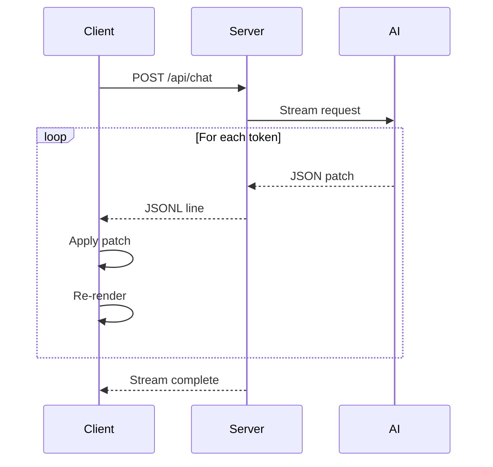

# json-render Streaming Protocol Reference

This document covers the JSONL streaming protocol used by json-render for progressive UI rendering.

## Table of Contents

- [Overview](#overview)
- [JSONL Format](#jsonl-format)
- [Patch Operations](#patch-operations)
- [Progressive Rendering](#progressive-rendering)
- [API Endpoint Implementation](#api-endpoint-implementation)
- [AI Model Integration](#ai-model-integration)
- [Error Handling](#error-handling)
- [Performance Optimization](#performance-optimization)

## Overview

json-render uses a streaming JSONL protocol to progressively build UI as the AI generates it. This provides:

1. **Immediate feedback**: Users see UI appearing in real-time
2. **Efficient updates**: Only changes are transmitted
3. **Interruptible**: Users can cancel mid-generation
4. **Recoverable**: Partial UI is usable if stream fails



## JSONL Format

JSONL (JSON Lines) uses newline-delimited JSON objects. Each line is a complete, valid JSON object.

### Basic Structure

```jsonl
{"op":"set","path":"/ui","value":{"type":"container","children":[]}}
{"op":"add","path":"/ui/children/-","value":{"type":"text","text":"Hello"}}
{"op":"add","path":"/ui/children/-","value":{"type":"text","text":" World"}}
```

### Line Format

Each line follows the JSON Patch format (RFC 6902):

```typescript
interface JSONPatch {
  op: 'set' | 'add' | 'remove' | 'replace';
  path: string;      // JSON Pointer path
  value?: unknown;   // Value for set/add/replace operations
}
```

## Patch Operations

### set Operation

Sets a value at a path, creating intermediate objects as needed:

```jsonl
{"op":"set","path":"/ui","value":{"type":"card","title":"Welcome"}}
```

Before:
```json
{}
```

After:
```json
{
  "ui": {
    "type": "card",
    "title": "Welcome"
  }
}
```

### add Operation

Adds a value to an array or object:

```jsonl
{"op":"add","path":"/ui/children/-","value":{"type":"text","text":"Item"}}
```

The `-` at the end of the path means "append to array".

Before:
```json
{
  "ui": {
    "type": "card",
    "children": []
  }
}
```

After:
```json
{
  "ui": {
    "type": "card",
    "children": [
      { "type": "text", "text": "Item" }
    ]
  }
}
```

### Adding to Specific Index

```jsonl
{"op":"add","path":"/ui/children/0","value":{"type":"text","text":"First"}}
```

This inserts at index 0, shifting existing elements.

### replace Operation

Replaces an existing value:

```jsonl
{"op":"replace","path":"/ui/title","value":"Updated Title"}
```

### remove Operation

Removes a value:

```jsonl
{"op":"remove","path":"/ui/children/0"}
```

### Nested Paths

JSON Pointer paths can be deeply nested:

```jsonl
{"op":"set","path":"/ui/children/0/props/style/color","value":"red"}
```

### Data Model Updates

The data model can also be updated via patches:

```jsonl
{"op":"set","path":"/data/user","value":{"name":"John","email":"john@example.com"}}
{"op":"set","path":"/data/items","value":[]}
{"op":"add","path":"/data/items/-","value":{"id":"1","name":"Product"}}
```

## Progressive Rendering

### Typical Stream Flow

```jsonl
{"op":"set","path":"/ui","value":{"type":"container","layout":"column","children":[]}}
{"op":"add","path":"/ui/children/-","value":{"type":"heading","text":"Product Details"}}
{"op":"add","path":"/ui/children/-","value":{"type":"image","src":"","alt":"Loading..."}}
{"op":"replace","path":"/ui/children/1/src","value":"https://example.com/product.jpg"}
{"op":"add","path":"/ui/children/-","value":{"type":"text","text":"A great product..."}}
{"op":"add","path":"/ui/children/-","value":{"type":"container","layout":"row","children":[]}}
{"op":"add","path":"/ui/children/3/children/-","value":{"type":"button","label":"Add to Cart","action":"addToCart"}}
{"op":"add","path":"/ui/children/3/children/-","value":{"type":"button","label":"Save","action":"save","variant":"secondary"}}
```

### Progressive Text Content

For long text, the AI can stream incrementally:

```jsonl
{"op":"add","path":"/ui/children/-","value":{"type":"text","text":""}}
{"op":"replace","path":"/ui/children/0/text","value":"This"}
{"op":"replace","path":"/ui/children/0/text","value":"This is"}
{"op":"replace","path":"/ui/children/0/text","value":"This is a"}
{"op":"replace","path":"/ui/children/0/text","value":"This is a longer"}
{"op":"replace","path":"/ui/children/0/text","value":"This is a longer piece"}
{"op":"replace","path":"/ui/children/0/text","value":"This is a longer piece of"}
{"op":"replace","path":"/ui/children/0/text","value":"This is a longer piece of text."}
```

## API Endpoint Implementation

### Next.js App Router

```typescript
// app/api/chat/route.ts
import { generateCatalogPrompt } from '@json-render/core';
import { catalog } from '@/lib/catalog';
import { openai } from '@ai-sdk/openai';
import { streamText } from 'ai';

export async function POST(req: Request) {
  const { messages } = await req.json();

  const systemPrompt = generateCatalogPrompt(catalog, {
    instructions: 'Generate UI for the user request.',
  });

  const result = await streamText({
    model: openai('gpt-4o'),
    system: systemPrompt,
    messages,
  });

  // Return as streaming response
  return result.toDataStreamResponse();
}
```

### Express.js

```typescript
import express from 'express';
import { generateCatalogPrompt } from '@json-render/core';
import OpenAI from 'openai';

const app = express();
const openai = new OpenAI();

app.post('/api/chat', async (req, res) => {
  const { messages } = req.body;

  const systemPrompt = generateCatalogPrompt(catalog);

  // Set headers for streaming
  res.setHeader('Content-Type', 'text/event-stream');
  res.setHeader('Cache-Control', 'no-cache');
  res.setHeader('Connection', 'keep-alive');

  const stream = await openai.chat.completions.create({
    model: 'gpt-4o',
    messages: [
      { role: 'system', content: systemPrompt },
      ...messages,
    ],
    stream: true,
  });

  for await (const chunk of stream) {
    const content = chunk.choices[0]?.delta?.content;
    if (content) {
      // Parse and forward JSONL lines
      const lines = content.split('\n').filter(Boolean);
      for (const line of lines) {
        res.write(`data: ${line}\n\n`);
      }
    }
  }

  res.end();
});
```

### Hono

```typescript
import { Hono } from 'hono';
import { stream } from 'hono/streaming';
import { generateCatalogPrompt } from '@json-render/core';

const app = new Hono();

app.post('/api/chat', async (c) => {
  const { messages } = await c.req.json();
  const systemPrompt = generateCatalogPrompt(catalog);

  return stream(c, async (stream) => {
    const response = await openai.chat.completions.create({
      model: 'gpt-4o',
      messages: [
        { role: 'system', content: systemPrompt },
        ...messages,
      ],
      stream: true,
    });

    for await (const chunk of response) {
      const content = chunk.choices[0]?.delta?.content;
      if (content) {
        await stream.write(content);
      }
    }
  });
});
```

## AI Model Integration

### System Prompt Structure

The `generateCatalogPrompt()` function creates a prompt that teaches the AI:

```typescript
const prompt = generateCatalogPrompt(catalog, {
  instructions: 'Your custom instructions here.',
});

/*
Generated prompt structure:

# UI Generation Protocol

You generate user interfaces using JSONL patches. Each line must be valid JSON.

## Available Components

### card
Properties:
- title (string, optional): Card title
- children (array, optional): Child elements

### text
Properties:
- text (string, required): Text content
- variant (enum: 'body' | 'heading' | 'caption', optional)

...

## Available Actions

### submit
Payload:
- endpoint (string, required): API endpoint
- method (enum: 'GET' | 'POST', optional)

...

## Patch Format

Use these operations:
- {"op":"set","path":"...","value":{...}}
- {"op":"add","path":"...","value":{...}}

## Examples

[Examples if provided]

## Instructions

Your custom instructions here.
*/
```

### Model Requirements

The AI model must:

1. Generate valid JSONL (one JSON object per line)
2. Use the correct patch operation format
3. Reference only components from the catalog
4. Use valid JSON Pointer paths

### Prompt Engineering Tips

```typescript
const prompt = generateCatalogPrompt(catalog, {
  instructions: `
    Generate UI following these guidelines:

    1. Start with a container element as root
    2. Build UI progressively - add elements one at a time
    3. Use semantic component types (heading for titles, not text)
    4. Include loading states for async operations
    5. Add error handling UI for form submissions
    6. Use data binding for dynamic content
    7. Include confirmation dialogs for destructive actions

    Response format:
    - Output ONLY JSONL patches, no other text
    - Each line must be complete valid JSON
    - Use proper JSON escaping for special characters
  `,
});
```

## Error Handling

### Invalid JSON Recovery

```typescript
function parseJSONLLine(line: string): JSONPatch | null {
  try {
    return JSON.parse(line);
  } catch (error) {
    console.warn('Invalid JSON line:', line);
    return null;
  }
}

function processStream(stream: ReadableStream<string>) {
  let buffer = '';

  return new ReadableStream({
    async start(controller) {
      const reader = stream.getReader();

      while (true) {
        const { done, value } = await reader.read();
        if (done) break;

        buffer += value;
        const lines = buffer.split('\n');
        buffer = lines.pop() || ''; // Keep incomplete line

        for (const line of lines) {
          const trimmed = line.trim();
          if (!trimmed) continue;

          const patch = parseJSONLLine(trimmed);
          if (patch) {
            controller.enqueue(patch);
          }
        }
      }

      // Process remaining buffer
      if (buffer.trim()) {
        const patch = parseJSONLLine(buffer.trim());
        if (patch) {
          controller.enqueue(patch);
        }
      }

      controller.close();
    },
  });
}
```

### Stream Interruption

Handle stream cancellation gracefully:

```typescript
function useUIStream(endpoint: string) {
  const [ui, setUI] = useState<UITree | null>(null);
  const abortController = useRef<AbortController | null>(null);

  const sendMessage = async (message: string) => {
    // Cancel previous request
    abortController.current?.abort();
    abortController.current = new AbortController();

    try {
      const response = await fetch(endpoint, {
        method: 'POST',
        body: JSON.stringify({ message }),
        signal: abortController.current.signal,
      });

      // Process stream...
    } catch (error) {
      if (error.name === 'AbortError') {
        // Stream was cancelled, UI remains in last valid state
        return;
      }
      throw error;
    }
  };

  const abort = () => {
    abortController.current?.abort();
  };

  return { ui, sendMessage, abort };
}
```

### Partial State Recovery

If the stream fails mid-generation, the UI remains in the last valid state:

```typescript
function applyPatchSafely(tree: UITree, patch: JSONPatch): UITree {
  try {
    return applyPatch(tree, patch);
  } catch (error) {
    console.error('Failed to apply patch:', patch, error);
    // Return unchanged tree instead of throwing
    return tree;
  }
}
```

## Performance Optimization

### Batching Updates

Batch rapid updates to reduce re-renders:

```typescript
function useBatchedUpdates<T>(
  applyUpdate: (state: T, update: JSONPatch) => T,
  initialState: T,
  batchMs = 16 // ~60fps
) {
  const [state, setState] = useState(initialState);
  const pendingPatches = useRef<JSONPatch[]>([]);
  const rafId = useRef<number | null>(null);

  const applyBatch = useCallback(() => {
    if (pendingPatches.current.length === 0) return;

    setState(current => {
      let next = current;
      for (const patch of pendingPatches.current) {
        next = applyUpdate(next, patch);
      }
      return next;
    });

    pendingPatches.current = [];
    rafId.current = null;
  }, [applyUpdate]);

  const addPatch = useCallback((patch: JSONPatch) => {
    pendingPatches.current.push(patch);

    if (rafId.current === null) {
      rafId.current = requestAnimationFrame(applyBatch);
    }
  }, [applyBatch]);

  return [state, addPatch] as const;
}
```

### Selective Re-rendering

Use React.memo and useMemo to prevent unnecessary re-renders:

```tsx
const UIElement = React.memo(function UIElement({
  element,
  components
}: {
  element: UIElement;
  components: ComponentRegistry;
}) {
  const Component = components[element.type];
  if (!Component) return null;

  return <Component {...element} />;
}, (prev, next) => {
  // Custom comparison for deep equality
  return isEqual(prev.element, next.element);
});
```

### Virtualization for Large UIs

For UIs with many elements, use virtualization:

```tsx
import { FixedSizeList } from 'react-window';

function VirtualizedList({ items, components }: Props) {
  return (
    <FixedSizeList
      height={600}
      width="100%"
      itemCount={items.length}
      itemSize={50}
    >
      {({ index, style }) => (
        <div style={style}>
          <UIElement element={items[index]} components={components} />
        </div>
      )}
    </FixedSizeList>
  );
}
```

### Compression

For large UIs, consider compressing the stream:

```typescript
// Server
app.post('/api/chat', async (req, res) => {
  res.setHeader('Content-Encoding', 'gzip');

  const gzip = createGzip();
  gzip.pipe(res);

  for await (const chunk of stream) {
    gzip.write(chunk);
  }

  gzip.end();
});

// Client
const response = await fetch('/api/chat', {
  headers: {
    'Accept-Encoding': 'gzip',
  },
});
// Browser automatically decompresses
```

## Related Documentation

- [json-render Overview](./json-render.md) - Main documentation
- [Catalog System Reference](./json-render-catalog.md) - Catalog API details
- [React Integration Guide](./json-render-react.md) - React hooks and components
