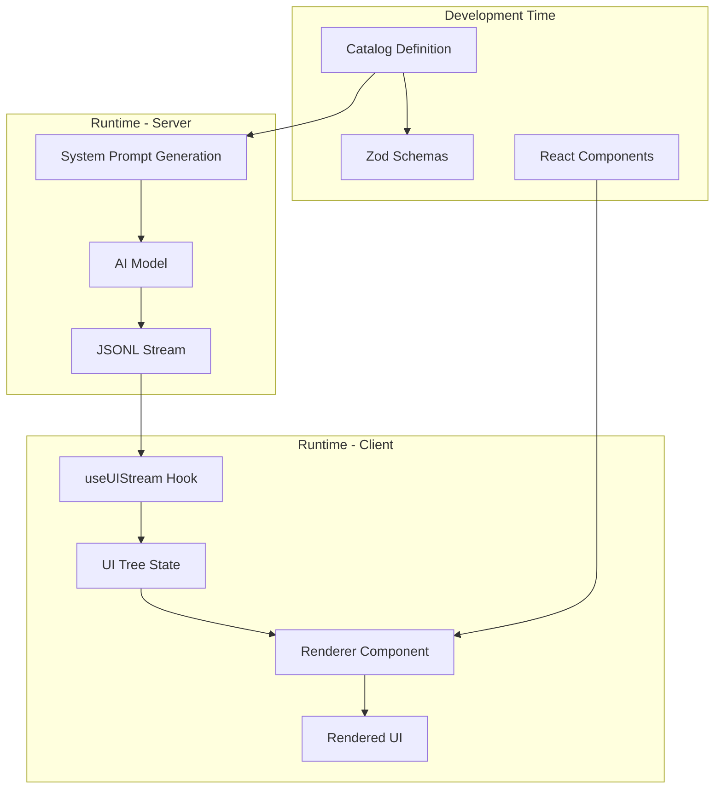

# json-render: AI-Powered UI Generation

This document provides comprehensive documentation for [json-render](https://github.com/vercel-labs/json-render), a TypeScript/React library that enables AI models to generate predictable, guardrailed user interfaces through a streaming JSONL protocol.

## Table of Contents

- [Overview](#overview)
- [Architecture](#architecture)
- [Core Concepts](#core-concepts)
- [Package Structure](#package-structure)
- [Type System](#type-system)
- [Installation](#installation)
- [Quick Start](#quick-start)
- [Complete Example](#complete-example)
- [Related Documentation](#related-documentation)

## Overview

json-render solves the challenge of AI-generated UI by providing a structured, guardrailed approach. Instead of allowing AI models to generate arbitrary HTML or code, json-render:

1. **Defines a catalog** of available components with Zod schemas
2. **Generates system prompts** that teach AI models the available UI vocabulary
3. **Streams UI updates** progressively via JSONL patches
4. **Renders React components** from the JSON element tree
5. **Handles data binding**, actions, visibility, and validation

This approach ensures AI models can only produce valid UI within predefined boundaries while maintaining a rich, interactive user experience.

## Architecture



### Data Flow

1. **Catalog Creation**: Define components, actions, and validation using Zod schemas
2. **Prompt Generation**: `generateCatalogPrompt()` creates AI instructions
3. **AI Response**: Model generates JSONL patches (`set` and `add` operations)
4. **Stream Processing**: `useUIStream` applies patches to build UI tree
5. **Rendering**: `Renderer` maps JSON elements to React components

## Core Concepts

### Catalog System

The catalog defines everything an AI model can use:

- **Components**: UI elements with typed props (buttons, cards, forms, etc.)
- **Actions**: Operations users can trigger (submit, navigate, confirm)
- **Validation**: Input validation functions (email, required, minLength)

See [Catalog System Reference](./json-render-catalog.md) for details.

### Streaming Protocol

json-render uses JSONL (newline-delimited JSON) with two patch operations:

```jsonl
{"op":"set","path":"/ui","value":{"type":"card","children":[]}}
{"op":"add","path":"/ui/children/-","value":{"type":"text","text":"Hello"}}
```

See [Streaming Protocol Reference](./json-render-streaming.md) for details.

### Data Binding

Dynamic values reference data using JSON Pointer paths:

```json
{
  "type": "text",
  "text": { "$data": "/user/name" }
}
```

### Visibility System

Conditional rendering based on data, auth, or logic:

```json
{
  "type": "adminPanel",
  "visible": { "$auth": ["admin", "superuser"] }
}
```

## Package Structure

json-render consists of two main packages:

### @json-render/core

Framework-agnostic core functionality:

| Export | Description |
|--------|-------------|
| `createCatalog()` | Create a component/action catalog |
| `generateCatalogPrompt()` | Generate AI system prompt |
| `UITree` | UI tree state management |
| `DataModel` | Data state container |
| `applyPatch()` | Apply JSONL patches |

### @json-render/react

React-specific components and hooks:

| Export | Description |
|--------|-------------|
| `Renderer` | Render UI tree to React |
| `JSONUIProvider` | Context provider wrapper |
| `useUIStream` | Process streaming responses |
| `useData`, `useDataValue` | Access data model |
| `useActions`, `useAction` | Trigger actions |
| `useVisibility`, `useIsVisible` | Conditional rendering |
| `useValidation`, `useFieldValidation` | Form validation |

See [React Integration Guide](./json-render-react.md) for details.

## Type System

### UIElement

The base type for all UI elements:

```typescript
interface UIElement {
  type: string;              // Component type from catalog
  id?: string;               // Optional unique identifier
  visible?: VisibilityRule;  // Conditional visibility
  [key: string]: unknown;    // Component-specific props
}
```

### UITree

Container for the complete UI structure:

```typescript
interface UITree {
  ui: UIElement | null;      // Root element
  data?: Record<string, unknown>;  // Data model
}
```

### DynamicValue

Reference to data model values:

```typescript
// Simple data reference
type DataRef = { $data: string };  // JSON Pointer path

// Interpolated string
type InterpolatedString = {
  $template: string;         // "Hello, {{/user/name}}!"
};

// Computed expression
type ComputedValue = {
  $expr: string;             // JavaScript-like expression
};

type DynamicValue<T> = T | DataRef | InterpolatedString | ComputedValue;
```

### VisibilityRule

Conditional visibility configuration:

```typescript
type VisibilityRule =
  | boolean                          // Static visibility
  | { $data: string }               // Based on data value
  | { $auth: string[] }             // Based on user roles
  | { $and: VisibilityRule[] }      // All conditions must match
  | { $or: VisibilityRule[] }       // Any condition must match
  | { $not: VisibilityRule };       // Negation
```

### ActionDefinition

Action configuration:

```typescript
interface ActionDefinition {
  type: string;              // Action type from catalog
  payload?: Record<string, DynamicValue<unknown>>;
  confirm?: {
    title: string;
    message: string;
    confirmLabel?: string;
    cancelLabel?: string;
  };
}
```

## Installation

```bash
npm install @json-render/core @json-render/react
# or
pnpm add @json-render/core @json-render/react
# or
yarn add @json-render/core @json-render/react
```

## Quick Start

### 1. Define Your Catalog

```typescript
import { createCatalog, z } from '@json-render/core';

const catalog = createCatalog({
  components: {
    card: z.object({
      title: z.string().optional(),
      children: z.array(z.lazy(() => elementSchema)).optional(),
    }),
    text: z.object({
      text: z.string(),
      variant: z.enum(['body', 'heading', 'caption']).optional(),
    }),
    button: z.object({
      label: z.string(),
      action: z.string(),
      variant: z.enum(['primary', 'secondary', 'danger']).optional(),
    }),
  },
  actions: {
    submit: z.object({
      endpoint: z.string(),
      method: z.enum(['GET', 'POST', 'PUT', 'DELETE']).optional(),
    }),
    navigate: z.object({
      url: z.string(),
    }),
  },
});
```

### 2. Create React Components

```typescript
import { ComponentRegistry } from '@json-render/react';

const components: ComponentRegistry = {
  card: ({ title, children, renderChildren }) => (
    <div className="card">
      {title && <h2>{title}</h2>}
      {renderChildren(children)}
    </div>
  ),
  text: ({ text, variant = 'body' }) => (
    <p className={`text-${variant}`}>{text}</p>
  ),
  button: ({ label, action, onAction }) => (
    <button onClick={() => onAction(action)}>{label}</button>
  ),
};
```

### 3. Set Up the Provider

```tsx
import { JSONUIProvider, Renderer } from '@json-render/react';

function App() {
  const { ui, isLoading } = useUIStream('/api/chat');

  return (
    <JSONUIProvider
      components={components}
      catalog={catalog}
      onAction={handleAction}
    >
      {isLoading && <LoadingSpinner />}
      <Renderer tree={ui} />
    </JSONUIProvider>
  );
}
```

## Complete Example

Here's a full example showing an AI-powered product configurator:

### Catalog Definition

```typescript
// catalog.ts
import { createCatalog, z } from '@json-render/core';

export const productCatalog = createCatalog({
  components: {
    productCard: z.object({
      productId: z.string(),
      name: z.string(),
      price: z.number(),
      image: z.string().url(),
      description: z.string().optional(),
      inStock: z.boolean().default(true),
    }),
    optionSelector: z.object({
      label: z.string(),
      options: z.array(z.object({
        value: z.string(),
        label: z.string(),
        priceModifier: z.number().optional(),
      })),
      dataPath: z.string(), // Where to store selection
    }),
    priceDisplay: z.object({
      basePrice: z.number(),
      modifiers: z.array(z.object({
        label: z.string(),
        amount: z.number(),
      })).optional(),
    }),
    container: z.object({
      layout: z.enum(['row', 'column', 'grid']).default('column'),
      gap: z.number().optional(),
      children: z.array(z.lazy(() => elementSchema)).optional(),
    }),
  },
  actions: {
    addToCart: z.object({
      productId: z.string(),
      configuration: z.record(z.string()),
      quantity: z.number().default(1),
    }),
    updateSelection: z.object({
      path: z.string(),
      value: z.unknown(),
    }),
  },
  validation: {
    required: () => (value) =>
      value !== undefined && value !== '' ? null : 'This field is required',
    minQuantity: (min: number) => (value) =>
      Number(value) >= min ? null : `Minimum quantity is ${min}`,
  },
});
```

### React Components

```tsx
// components.tsx
import { ComponentRegistry, useDataValue, useAction } from '@json-render/react';

export const productComponents: ComponentRegistry = {
  productCard: ({ productId, name, price, image, description, inStock }) => (
    <div className="product-card">
      
      <h3>{name}</h3>
      <p className="price">${price.toFixed(2)}</p>
      {description && <p>{description}</p>}
      {!inStock && <span className="out-of-stock">Out of Stock</span>}
    </div>
  ),

  optionSelector: ({ label, options, dataPath }) => {
    const [value, setValue] = useDataValue(dataPath);
    const updateSelection = useAction('updateSelection');

    const handleChange = (newValue: string) => {
      setValue(newValue);
      updateSelection({ path: dataPath, value: newValue });
    };

    return (
      <div className="option-selector">
        <label>{label}</label>
        <select value={value || ''} onChange={(e) => handleChange(e.target.value)}>
          <option value="">Select...</option>
          {options.map((opt) => (
            <option key={opt.value} value={opt.value}>
              {opt.label}
              {opt.priceModifier && ` (+$${opt.priceModifier})`}
            </option>
          ))}
        </select>
      </div>
    );
  },

  priceDisplay: ({ basePrice, modifiers = [] }) => {
    const total = modifiers.reduce((sum, m) => sum + m.amount, basePrice);

    return (
      <div className="price-display">
        <div className="base-price">Base: ${basePrice.toFixed(2)}</div>
        {modifiers.map((mod, i) => (
          <div key={i} className="modifier">
            {mod.label}: +${mod.amount.toFixed(2)}
          </div>
        ))}
        <div className="total">Total: ${total.toFixed(2)}</div>
      </div>
    );
  },

  container: ({ layout, gap, children, renderChildren }) => (
    <div
      className={`container-${layout}`}
      style={{ gap: gap ? `${gap}px` : undefined }}
    >
      {renderChildren(children)}
    </div>
  ),
};
```

### API Endpoint

```typescript
// app/api/configure/route.ts
import { generateCatalogPrompt } from '@json-render/core';
import { productCatalog } from '@/lib/catalog';
import { openai } from '@ai-sdk/openai';
import { streamText } from 'ai';

export async function POST(req: Request) {
  const { messages } = await req.json();

  const systemPrompt = generateCatalogPrompt(productCatalog, {
    instructions: `
      You are a product configuration assistant. Help users customize
      products by showing them available options and updating the UI
      as they make selections.

      Always show the current price based on selected options.
      Use confirmation dialogs before adding items to cart.
    `,
  });

  const result = await streamText({
    model: openai('gpt-4o'),
    system: systemPrompt,
    messages,
  });

  return result.toDataStreamResponse();
}
```

### App Component

```tsx
// app/page.tsx
'use client';

import { JSONUIProvider, Renderer, useUIStream } from '@json-render/react';
import { productCatalog } from '@/lib/catalog';
import { productComponents } from '@/lib/components';
import { useState } from 'react';

export default function ConfiguratorPage() {
  const [input, setInput] = useState('');
  const { ui, isLoading, sendMessage } = useUIStream('/api/configure');

  const handleAction = async (action: string, payload: unknown) => {
    switch (action) {
      case 'addToCart':
        // Handle add to cart
        console.log('Adding to cart:', payload);
        break;
      case 'updateSelection':
        // Selections are handled automatically by data binding
        break;
    }
  };

  return (
    <div className="configurator">
      <JSONUIProvider
        components={productComponents}
        catalog={productCatalog}
        onAction={handleAction}
      >
        <div className="chat-input">
          <input
            value={input}
            onChange={(e) => setInput(e.target.value)}
            placeholder="Describe what you're looking for..."
          />
          <button onClick={() => sendMessage(input)}>Send</button>
        </div>

        <div className="ui-container">
          {isLoading && <div className="loading">Generating UI...</div>}
          <Renderer tree={ui} />
        </div>
      </JSONUIProvider>
    </div>
  );
}
```

## Related Documentation

- [Catalog System Reference](./json-render-catalog.md) - Detailed catalog API
- [React Integration Guide](./json-render-react.md) - React hooks and components
- [Streaming Protocol Reference](./json-render-streaming.md) - JSONL protocol details
- [GitHub Repository](https://github.com/vercel-labs/json-render) - Source code and examples
